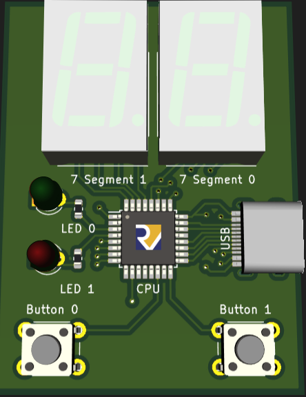
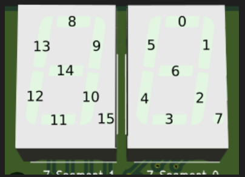

# Atividade 3

Nessa atividade, você vai utilizar o simulador da placa de 7 segmentos (Seven Segment Board)

!!! tip "Regras gerais"
    * Essa atividade é individual e você não pode olhar nem compartilhar código com outros colegas
    * Você pode conversar com outros colegas sobre a atividade, mas não pode compartilhar código
    * Seu código deve ser desenvolvido individualmente
    * Entregue no Google Classrom e você deve entregar apenas um arquivo de código
    * Coloque um comentário no início do seu código contendo seu RA e nome completo.

## O simulador da placa de 7 segmentos

A placa do simulador, que pode ser visualizada através da opção **View** > **Seven Segment Board**, é uma placa com dois botões, dois LEDs e dois displays de 7 segmentos, conforme a figura abaixo. Nessa atividade, você deverá utiliza-la para realizar seu trabalho.

A seguir você terá uma explicação breve sobre o funcionamento da placa e pode olhar mais detalhes na documentação do simulador. 

### Displays de 7 segmentos

O termo 7 segmentos significa as 7 barras que compõem o display de um dígito, conforme a figura abaixo. Utilizando o número 1 como exemplo, as duas barras do lado direito (superior e inferior) precisam estar ativas para que ele seja representado. Cada barra é representada por um bit de um número de 16 bits conforme a figura abaixo. O bit 0 representa a barra superior do display mais à direita. Então, o número 1 informado acima, pode ser representado como sendo o valor em binário 0b110 (com os bits 1 e 2 ativos).

Você pode escrever no display através da `ecall 0x120` informando dois parâmetros:

* `a1`: valor a ser escrito no display com os bits ativos conforme a figura acima
* `a2`: máscara indicativa de quais bits você quer alterar no display. Somente os bits marcados como 1 nessa máscara terão seus valores alterados conforme o registrador `a1` acima. A forma mais comum é utilizar essa máscara com o valor `-1` (todos os bits ativos) e sempre fornecer `a1` com a configuração completa.

### Leds

Existem 2 leds na placa, o led verde (númebitro 0) e o led vermelho (bit 1). A `ecall 0x121` define o valor do led conforme o valor do registrador `a1`, considerando os dois bits fornecidos. 

### Botões

Existem 2 botões na placa, o botão 0 e o botão 1. A `ecall 0x122` lê o valor dos botões e retorna no registrador `a0` o valor dos botões. O bit 0 indica o valor do botão 0 e o bit 1 indica o valor do botão 1. O valor 1 indica que o botão está pressionado e o valor 0 indica que o botão não está pressionado.

Do ponto de vista do simulador, uma vez pressionado o botão, ele ficará apertado até ser lido. Após ser lido, ele será desapertado. Isso significa que se você pressionar o botão e ler o valor dele 3 vezes, você terá o valor 1 na primeira leitura e o valor 0 nas 2 últimas leituras.

Ecall 0x122: Read push buttons
This reads whether the push buttons have been pressed. Once the push buttons are pressed they will visually be highlighted as the environment will buffer this press. The ecall whether the two buttons were pressed in the lowest two bits of a0 and resets the buffers.

## Atividade

Implemente um programa que interaja com a placa e os periféricos de forma a mostrar um contador nos dois displays. Esse contador deve começar pelo valor 00 e ser incrementado automaticamente de forma crescente e legível.

Caso o botão 0 seja pressionado, o contador deve passar a contar em forma decrescente (ser decrementado). Caso o botão 1 seja pressionado, o contador deve voltar a contar em forma crescente. A direção da contagem não afeta a velocidade do contador. Você pode definir a velocidade de forma que seja possível visualizar o contador mudando de valor, como fez na atividade 1 com uma função Pausa.

Quando o contador chegar ao número 99 na forma crescente, ele deve passar para 00 na próxima interação. Quando chegar no número 00 na forma decrescente, ele deve passar para 99 na próxima interação.

O led verde deve ser aceso quando o contador estiver na forma crescente e o led vermelho deve ser aceso quando o contador estiver na forma decrescente.

Organize seu código em funções para facilitar a leitura dos componentes e as respostas necessárias às entradas.

??? tip "Dicas"
    * Declare os valores dos bits para representar cada número no display num vetor de forma a facilitar sua utilização. Você só precisa declarar um dígito (0-9).
    * Utilize a máscara `-1` para sempre alterar todos os bits do display
    * Implemente uma função que recebe um número de dois dígitos e escreve no display, assim seu código fica mais legível e fácil de gerenciar.

