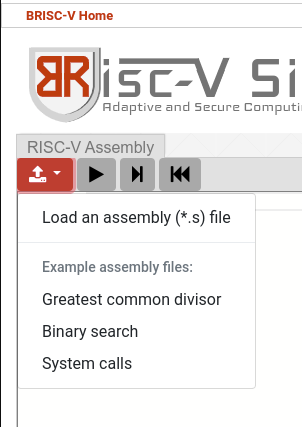

# Laboratório 1

A intenção desse laboratório é fornecer uma visão geral do primeiro ambiente de simulação utilizado na disciplina. Para isso, um exemplo de código será fornecido e depois você terá recomendações para altera-lo para explorar variações.

!!! tip "Dica"
    Você não precisa entregar nenhum código como resposta. Procure entender os conceitos e explorar as variações.

!!! tip "Dica"
    Você pode utilizar o simulador RISC-V para testar os códigos que você desenvolver. Para isso, veja as dicas fornecidas logo abaixo.


## Simulador RISC-V

Numa outra aba ou janela, abra o [simulador RISC-V](https://ascslab.org/research/briscv/simulator/simulator.html) que utilizaremos nesses primeiros laboratórios da disciplina. A imagem abaixo ilustra a tela que deve aparecer.


No canto esquerdo (área em branco na imagem), há um espaço para você carregar um programa em assembly. Apesar de permitir a edição nesse campo, você não pode editar o programa diretamente. No meio, em cinza, há uma listagem dos 32 registradores do processador seguido de seus valores (todos zerados por enquanto). à direita, o espaço em cinza será utilizado para mostrar o conteúdo da memória.

Os registradores do processador são locais de armazenamento temporário de valores que podemos, inicialmente, considerar como variáveis. Especificamente nos exemplos abaixo, serão utilizados os registradores temporários de **t0** até **t6**. Além deles também será utilizado o registrador **zero** que tem um significado especial por sempre conter o valor zero.

## Primeiro código em Assembly

Copie o código abaixo cole-o num editor de texto com o nome lab01-1.s e carregue esse código utilizando o botão vermelho do simulador, utilizando a opção _Load an assembly (*.s) file_ conforme ilustrado abaixo.

```MIPS
main:
  addi t0, zero, 1        # t0 = 0 + 1
  addi t1, zero, 2        # t1 = 0 + 2
  add  t2, t1, t0         # t2 = t1 + t0 
  ret
```



Note que, ao carregar o arquivo, várias linhas antes e depois de seu código serão incluídas. Essas linhas foram desenvolvidas para permitir a correta execução do seu programa que é apenas a parte branca ao meio. Após o carregamento, todos os botões ficam vermelhos, habilitados para execução. Na ordem, os botões vermelhos servem para:

  1. Carregar um programa em assembly ou os exemplos fornecidos pelo simulador
  1. Executar o programa até o fim
  1. Avançar uma instrução de simulação
  1. Retornar ao início do programa

## Executando o programa

Você pode assistir [um vídeo](https://youtu.be/4shJTVZY3wE) demonstrando o simulador executando outro código de exemplo. 

Como a intenção aqui é executar o programa e entender o que está acontecendo, siga os passos abaixo com o código do exemplo acima já carregado:

1. Utilize o botão de executar uma única instrução (terceiro botão vermelho da esquerda para a direita). Veja que ao final dessa instrução, a tarja azul indicativa de execução moveu para a linha abaixo.
1. Ao clicar novamente, a tarja irá para a linha iniciada por *kernel* e, clicando novamente, irá para a linha iniciada por *addi*. Note a mudança do valor do registrador sp ao executar essa linha. Você consegue notar a mudança de valor também através da cor destacando o novo valor do registrador. A instrução *addi* soma o segundo com o terceiro parâmetros e guarda a resposta no primeiro (nesse caso, o registrador sp).
1. A próxima instrução é uma instrução de chamada de função (*call*). Ela transfere a tarja azul para a função *main* e, ao clicar novamente, a tarja irá para a linha iniciada por *addi*.
1. Aqui começa o programa acima. A primeira instrução é *addi* que soma o segundo com o terceiro parâmetros e guarda a resposta no primeiro (nesse caso, o registrador t0). Note que o valor do registrador t0 muda de 0 para 1 ao executar essa instrução.
1. A próxima instrução é *addi* que soma o segundo com o terceiro parâmetros e guarda a resposta no primeiro (nesse caso, o registrador t1). Note que o valor do registrador t1 muda de 0 para 2 ao executar essa instrução.
1. A terceira instrução é *add*, que também soma o segundo com o terceiro parâmetros. Note que essa instrução não termina com a letra **i** como as anteriores. Essa letra **i** ao final de algumas instruções serve para indicar que o terceiro parâmetro é um número, não um registrador (esse número é chamado de imediato, por isso é abreviado por i). Essa instrução soma *t1* e *t0* e guarda o resultado em *t2*. Note que o valor do registrador t2 muda de 0 para 3 ao executar essa instrução.
1. A quarta instrução do programa carregado é a **ret**, que serve para retornar à instrução que chamou a função atual. Nesse caso, a função **main** foi chamada pela instrução **call** que está na linha 2. Assim, o código retornará para a instrução da linha 3.
1. O programa continuará em execução até entrar num laço entre as linhas 7 e 8 do código, que serão detalhadas posteriormente. Nesse momento, basta focar nas 4 instruções que foram inseridas pelo exemplo acima.

Você sempre pode retornar ao início da simulação utilizando o 4º botão vermelho da esquerda para a direita.

## Atividades para realizar nesse laboratório

As atividades abaixo servem para guiar sua prática. Se você tiver uma dúvida sobre alguma delas, procure pelos monitores ou professor da disciplina. Aproveite para tirar outras dúvidas que possam surgir também.

### Nem todos os registradores estão disponíveis

Você deve ter notado que o código em cinza faz uso de outros registradores automaticamente (como sp e ra por exemplo). Ainda teremos uma aula inteira sobre a utilidade dos registradores mas, nesse momento, vamos concentrar o código na utilização apenas dos registradores iniciados por **t** que são chamados de temporários e nos registradores iniciados por **s** que são chamados de salvos.

Como o nome já diz, registradores temporários podem ter seus valores alterados. Então outros códigos que serão executados junto com seu programa podem alterar algum ou todos esses registradores sem que você note, afetando a execução do seu programa.

!!! note "Atividade 1"
    Altere o código acima para que ele utilize apenas os registradores salvos **s0** até **s11**. Você pode utilizar o simulador para verificar se o código está correto.

### As constantes não são ilimitadas

Dada as restrições de codificação das instruções em Assembly, os valores numéricos, que chamaremos de constantes aqui, não podem ter quaisquer valores. Eles possuem limites que dependem do tipo de instrução. Os valores de imediatos que podem ser utilizados na instrução **addi** são limitados a 12 bits, ou seja, o valor máximo que pode ser utilizado é 2047. O valor mínimo é -2048.

!!! note "Atividade 2"
    Altere o código acima para que ele utilize valores de imediatos diferentes. Explore valores que são maiores que o permitido e veja qual é o resultado. Você pode utilizar o simulador para verificar se o código está correto. Note a diferença entre o valor do seu código e o valor mostrado, com campo da instrução, no bloco inferior direito da tela (logo abaixo de imm).

### Seu código pode receber entradas

Como é esperado, seu programa não precisa utilizar apenas os imediatos codificados nas instruções, você também pode utilizar valores que serão fornecidos pelo usuário. Para isso, é necessário utilizar uma sequência de instruções que faz a leitura do teclado. A sequência de duas instruções abaixo faz com que apareça uma janela para leitura de um número inteiro e ele seja guardado no registrador **a0**.

```mipsasm
addi t0, zero, 4   # escolhe a operacao de leitura de inteiro (4)
ecall              # efetua a operacao de leitura de inteiro
```

!!! note "Atividade 3"
    Altere o código para que ele comece com uma leitura de um número inteiro e some o valor 2 nesse número.

!!! tip "Dica"
    Ainda não te disseram que instrução copia um valor de um registrador para outro, mas você já sabe somar um valor de um registrador com o registrador **zero**, o que é equivalente a copiar o valor do registrador para outro registrador.

!!! tip "Dica"
    Você não precisa se restringir aos limites numéricos da atividade anterior ao digitar o número. Experimente digitar números maiores! O simulador suporta números de 32 bits, que são muito grandes.

### Seu código pode escrever um valor de saída

Escrever um número na saída envolve uma sequência de passos similar à de leitura de um número inteiro. Você pode utilizar a sequência de duas instruções abaixo para escrever um número inteiro na saída. Esse valor deve estar previamente armazenado no registrador **a0**.

```mipsasm
addi t0, zero, 1   # escolhe a operacao de escrita de inteiro (1)
ecall              # efetua a operacao de escrita de inteiro
```

!!! note "Atividade 4"
    Altere o código anterior para que ele escreva o valor da soma na saída.

### Leia dois números e escreva a soma deles

Agora que você já sabe ler do teclado e escrever na tela, faça o seu programa ler dois números e escrever a soma deles na tela.

!!! note "Atividade 5"
    Altere o código anterior para que ele leia dois números e escreva a soma deles na tela.

### Existem outras instruções possíveis

Até agora você só utilizou a instrução aritmética de soma. Existem outras instruções que você pode utilizar para operar sobre os dois números que vocẽ leu do teclado. A tabela abaixo lista algumas das instruções do processador que você pode experimentar agora. Todas elas utilizam o mesmo formato de 3 registradores já visto na instrução **add**. O resultado da operação é sempre guardado no primeiro registrador e a operação é executada entre os dois últimos registradores.

| Instrução | Funcionalidade |
|-----------|----------------|
| add       | Soma dois registradores |
| sub       | Subtrai dois registradores |
| and       | Faz a operação lógica E |
| or        | Faz a operação lógica OU |
| xor       | Faz a operação lógica OU exclusivo |
| sll       | Faz um deslocamento de bits para a esquerda |
| srl       | Faz um deslocamento de bits para a direita |

!!! note "Atividade 6"
    Altere o código anterior para que ele leia dois números e escreva o resultado de uma operação entre eles na tela. Você deve testar mais de uma instrução da tabela acima até ficar confortável com elas.

!!! tip "Dica"
    Você pode, inclusive, ler mais números se achar conveniente para testar mais instruções de uma só vez!

## Conclusões

Nas próximas semanas você vai desenvolver programas maiores e mais complexos, utilizando as instruções que veremos em sala de aula.

!!! success "Resumo"
    Se você executou os experimentos até aqui, você já tem noção de como executar instruções no simulador; que existem registradores diferentes; que você pode ler números do teclado e escrever na tela; que existem outras instruções.
