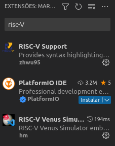

# Laboratório 7

Vamos trocar o simulador para realizar tarefas mais avançadas?

!!! tip "Dicas"
    * Você não precisa entregar nenhum código como resposta. Procure entender os conceitos e explorar as variações.
    * Você vai utilizar um novo simulador, chamado Venus, que pode ser executado online ou como plugin dentro do Visual Studio Code. Vamos utilizar preferencialmente a versão do VSCode pois tem mais componentes para praticarmos.
    * Não deixe de colocar comentários nos seus códigos. Procure organizar o código de forma que ele fique mais fácil de entender.
    * As dicas desse laboratório estão colapsadas. Para expandi-las, clique na pequena seta do lado direito da caixa de texto.

## Um pouco sobre o novo simulador

Cada simulador tem uma forma diferente de apresentar exatamente o mesmo processador. Cada instrução do RISC-V é codificada exatamente da mesma forma em qualquer lugar, mas a forma de apresentar o código assembly (como arquivo, copiando e colando) pode variar entre os simuladores. Vamos instalar o plugin do VSCode e ver como ele funciona?

Abra o VSCode e busque por **RISC-V Venus Simulator**. Instale o plugin e reinicie o VSCode (se necessário). Se não instalou ainda, recomendo também instalar o plugin **RISC-V Support**, para melhor visualizar seu código. As duas extensões estão indicadas na figura abaixo:



A partir de agora, você pode utilizar o próprio editor do VSCode e o comando de depurar (Menu **Executar > Iniciar Depuração**, ou apertar **F5**) ou executar (Menu **Executar > Iniciar Sem Depuração**, ou apertar **Ctrl+F5**). Antes de testar seu primeiro programa, algumas alterações serão necessárias na representação do código anterior. Para isso, veja abaixo o código da Atividade 2 do Laboratório 6, pronta para execução no Venus. Preste atenção nos comentários do código e também na listagem a seguir.

```mips-asm
.data
vetor: .word 5, 10, 20, 40, 80  # Você pode declarar todos os elementos na mesma linha

.text
main:
    li   a0, 5
    la   a1, vetor   # Pseudo-instrução para carregar o endereço do vetor 
                     # (no lugar das duas instruções anteriores)
    li   a2, 10
    call MultiplicaVetor

    la   s0, vetor
    li   s1, 5
imprime:
    beq  s1, zero, fimMain
    lw   a1, 0(s0)   # Sintaxe diferente para o lw que era lw a1, s0, 0
    addi s0, s0, 4
    addi s1, s1, -1
    li   a0, 1
    ecall     # Imprime o número
    li   a0, 11
    li   a1, 13
    ecall     # Imprime uma quebra de linha
    j    imprime

fimMain:
    addi a0, zero, 10
    ecall   # Encerra a execução do programa

MultiplicaVetor:
    # Movimenta o apontador da pilha 4 posicoes para baixo (16 bytes) e guarda 4 registradores na pilha
    addi sp, sp, -16
    sw   s0, 12(sp)   # Sintaxe diferente para o sw que era sw s0, sp, 12
    sw   s1, 8(sp)
    sw   s2, 4(sp)
    sw   ra, 0(sp)

    mv   s0, a0
    mv   s1, a1
    mv   s2, a2

for:
    beq  s0, zero, fim
    lw   a0, 0(s1)
    mv   a1, s2
    call Multiplica
    sw   a0, 0(s1)
    addi s1, s1, 4
    addi s0, s0, -1
    j    for

fim:
    # Movimenta o apontador da pilha 4 posicoes para cima (16 bytes) e recupera 4 registradores da pilha
    lw   ra, 0(sp)
    lw   s2, 4(sp)
    lw   s1, 8(sp)
    lw   s0, 12(sp)
    addi sp, sp, 16
    ret

Multiplica:
    # Multiplica a0 por a1 e guarda o resultado em a0
    # Utilizando deslocamentos para multiplicar os números bit a bit
    mv   t0, zero
loop:
    beq  a0, zero, fimMultiplica
    andi t1, a0, 1
    beq  t1, zero, nao
    add  t0, t0, a1
nao:
    slli a1, a1, 1
    srli a0, a0, 1
    j    loop
fimMultiplica:
    mv   a0, t0
    ret
```

Dentre as alterações, podemos destacar:

* Você pode declarar múltiplas palavras numa mesma linha após o .word, separando-as por vírgulas
* A pseudo-instrução `la` carrega o endereço de um label ou variável no registrador indicado. Ela é equivalente a `lui` + `addi` que eram utilizados anteriormente e o %hi não funciona nesse simulador
* A sintaxe do `lw` e `sw` é diferente. O primeiro parâmetro é o registrador que vai receber o valor carregado ou o valor que vai ser armazenado, respectivamente. O segundo e terceiro parâmetros agora ficam juntos, organizados como **offset(registrador)**. Por exemplo, `lw a1, s0, 0` deve ser escrito como `lw a1, 0(s0)`.
* Todas as chamadas de sistema (`ecall`) mudaram. Agora elas também consideram o seletor como um parâmetro, que fica sempre no **a0**, seguido dos demais parâmetros a partir do **a1**. Veja a [nova lista de ecalls](https://github.com/ThaumicMekanism/venus/wiki/Environmental-Calls). Você vai sentir falta da entrada de caracteres, que vamos trabalhar em seguida.
* Você deve chamar o sistema para encerrar a simulação. Note que não tem mais aquele código em cinza ao redor da main.
* Você pode declarar string com o tipo `.string` no lugar de `.byte` e pode colocar a string entre aspas logo em seguida. Essa string terá acrescentado o valor 0 (zero) no final, que indica o fim da string. Por exemplo, `msg: .string "Hello World!"` é equivalente a: `msg: .byte 72, 101, 108, 108, 111, 32, 87, 111, 114, 108, 100, 33, 0`. Muito mais fácil, não?

??? tip "Dica"
    Os programas devem continuar funcionando. O novo simulador continua sendo de um processador RISC-V

## Vamos revisar um código antigo?

!!! note "Atividade 1"
    Grave o código acima num arquivo chamado **lab07-1.s** e vamos iniciar a depuração! Você deve rodar o programa para se sentir confortável com a visualização dos registradores, da memória e do passo a passo das instruções no seu código.

Ao apertar **F5**, vai aparecer uma paleta de comandos como a que está abaixo:


Em ordem, os comandos servem para:

* Executar o programa até o final ou breakpoint
* Executar as funções como um único comando
* Executar cada instrução dentro da função (você vai utilizar esse botão a maioria das vezes)
* Retornar da função
* Recarregar a execução
* Parar a simulação

!!! note "Atividade 2"
    Pegue outro programa que você já construiu e converta-o para ser executado nesse simulador. Até o momento, você não deve utilizar programas que dependam de entradas do usuário. Se preciso, declare uma variável com o valor necessário.
  
## O novo simulador tem mais recursos!

Você lembra de ter perguntado se não existe uma instrução de multiplicação no RISC-V? A versão do processador do simulador antigo não tinha essa instrução mas a versão nova tem! Isso significa que você pode utilizar a instrução `mul` e suas variações, além da divisão (`div` e `rem`). Como exemplo, a instrução `mul t0, t1, a2` multiplica os valores contidos nos registradores **t1** e **a2** e guarda o resultado no registrador **t0**.

!!! note "Atividade 3"
    Modifique o código do programa anterior para utilizar a instrução `mul` ao invés da função `Multiplica`. Você deve remover a função `Multiplica` do seu código e implementar a multiplicação diretamente na função `MultiplicaVetor`.

!!! note "Atividade 4"
    Agora que você tem mais facilidade para digitar strings, coloque mensagens no seu código para indicar o produto dos números e também para falar que o programa acabou! A `ecall` de print_string é a 4.

## Utilizando a matriz de pontos do simulador

Seu simulador tem uma matriz de pontos, por padrão 10 x 10 pontos que pode ser visualizada utilizando a opção **Views > Led Matrix** do canto esquerdo da tela quando ele estiver ativo.

Para escrever um ponto na tela, você deve utilizar a **ecall 0x100**, que recebe como parâmetros o **x** (16 bits mais significativos) e o **y** (16 bits menos significativos) do ponto e a cor em RGB. Por exemplo, para escrever um ponto vermelho na posição (2,4), você deve utilizar a seguinte instrução:

```mipsasm
li a0, 0x100
li a1, 0x00020004
li a2, 0x00FF0000
ecall
```

O simulador também fornece a **ecall 0x101** para trocar a cor de todos os pontos da tela (o que equivale a limpar a tela se escolher branco ou preto). A chamada dessa syscall só precisa da cor em RGB. Por exemplo, para pintar a tela de branco, você deve utilizar o seguinte código:

```mipsasm
li a0, 0x101
li a1, 0x00FFFFFF
ecall
```

!!! note "Atividade 5"
    Experimente desenhar com múltiplas cores no painel. Faça um programa que pinte a tela de branco e depois desenhe um quadrado deixando dois pontos brancos em cada borda. Faça esse quadrado trocar de cor múltiplas vezes (você pode adiccionar valores nas cores ou armazenar um conjunto de cores num vetor e troca-las). Veja quanto tempo seu simulador gasta para pintar um quadrado e procure ajustar a velocidade do seu programa.

## Desafio final

O desafio de hoje é simples e nada polêmico. Faça um programa que desenhe a bandeira do seu time preferido de futebol!

!!! note "Atividade 6"
    Faça um programa que pinte a bandeira do seu time preferido de futebol no display.

## Conclusões

Você trocou de simulador, notou que tem algumas pequenas diferenças de sintaxe, em geral para melhorar seu código e também aprendeu a interagir com o display!

!!! success "Resumo"
    Você desenhou a bandeira do seu time de futebol!