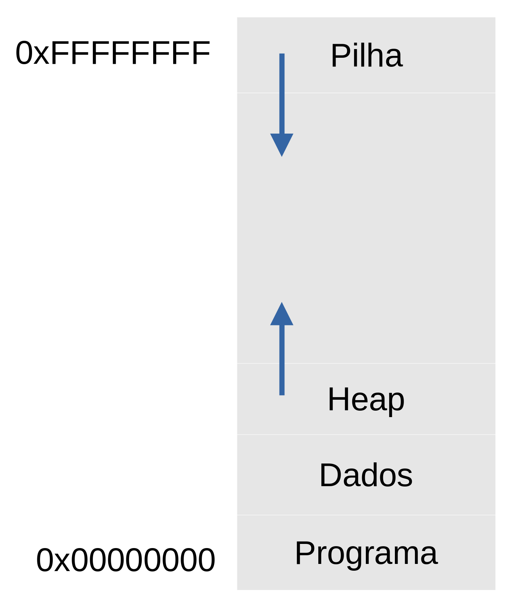

# Funções

Rodolfo Azevedo

MC404 - Organização Básica de Computadores e Linguagem de Montagem

http://www.ic.unicamp.br/~rodolfo/mc404

## O que é uma função?

Função é uma abstração para um conjunto de instruções que possui:

* Um ponto único de entrada
* Um ou mais pontos de saída
* Zero ou mais parâmetros de entrada
* Zero ou mais valores de saída
* Um nome (opcional para o processador)

## Instruções relevantes para construir uma função

* `CALL`: chama uma função
* `RET`: retorna de uma função

Ambas são pseudo-instruções relacionadas com instruções de salto.

* `CALL` é equivalente à `JAL ra, destino`, onde `ra` terá o endereço de retorno da função
* `RET` é equivalente à `JALR zero, ra, 0`, onde `ra` é o endereço para onde a função vai retornar, gravado anteriormente pela instrução `CALL`

## Exemplo de função

```mipsasm
# Função que recebe um valor em a0 e retorna o dobro em a0
# O nome da função é "dobro"
dobro:
    add a0, a0, a0
    ret

main:
    li a0, 10
    call dobro  # a0 = 20
    li a0, 5
    call dobro  # a0 = 10
    li a0, 1
    call dobro  # a0 = 2
    ret         # e agora? para onde volta?
```

## E como ficam os registradores?

Imagine que cada uma das funções abaixo foi implementada por um programador diferente. Que registradores cada um poderá alterar (`t`, `s` e `a`)?


## Convenções de registradores

* Agora que estamos organizando o código em funções, é importante definir a responsabilidade pelos valores de cada registrador
* Já temos que os registradores `t` são considerados como temporários e os `s` são considerados salvos. Mas o que significa isso?
* Vamos definir que os registradores `t` são temporários e podem ser alterados por qualquer função, enquanto os registradores `s` são salvos e devem ser preservados por qualquer função
* Os registradores `a` são usados para passar parâmetros para funções e receber valores de retorno

## Relembrando os registradores

| Registrador | Descrição |
|---|---|
| zero  | Valor fixo em zero (0) |
| ra    | Endereço de retorno de chamada de função |
| sp, gp, tp | Apontador de pilha, dados globais e de thread|
| t0-t6 | Valores temporários |
| s0-s11| Valores salvos |
| a0-a7 | Argumentos para função e valores de retorno |
| pc    | Contador de programa |  

## Convenções de registradores

| Registrador | O que pode ser feito? |
|---|---|
| t0-t6 | Qualquer função pode alterar, não é garantida a preservação por outra função|
| s0-s11| A função só pode alterar se preservar o valor anterior antes do retorno |
| a0-a7 | Funções podem alterar, não é garantida a preservação por outra função|

## Layout da memória do programa



* O programa é carregado na memória 
* A seguir, são carregados os dados do programa
* Depois existem dois espaços vazios que são reservados para uso do programa: Heap para variáveis dinâmicas e Stack (pilha) para valores temporários e endereços de retorno

## Pilha

* É um espaço de memória onde seu programa deve tratar como uma pilha de dados
* A pilha cresce para baixo: começa de endereços grandes e é decrementada
* A convenção de registradores reserva o registrador `sp` para apontar para o topo da pilha
* **`sp` indica o endereço do último elemento guardado na pilha**
* Utilize o `sp` nas instruções de `lw` e `sw` para acessar a pilha
* Não deixe de decrementar o `sp` antes de escrever um valor na pilha e incrementar depois de ler um valor
* Você realizar todos os decrementos de uma vez, bem como os incrementos

## Exemplo
  
### Inserindo 2 elementos na pilha

```mipsasm
addi sp, sp, -8
sw   ra, sp, 0
sw   s0, sp, 4
``` 

### Removendo 2 elementos da pilha

```mipsasm
lw   s0, sp, 4
lw   ra, sp, 0
addi sp, sp, 8
```

*Note a ordem invertida das instruções!*

## Exercício

Suponha a existência das funções ```scanf``` e ```printf``` da linguagem C para ler e escrever dados. Implemente um código que leia um número inteiro N, limitado a 20, em seguida ele deve ler N números inteiros sinalizados, guardando cada um num vetor e imprimir a soma desses números. Para a realizar a soma deles, você deve implementar uma função à parte que recebe um vetor e o seu tamanho, retornando a soma que, posteriormente, será impressa. Seu código deve começar na função ```main```.
