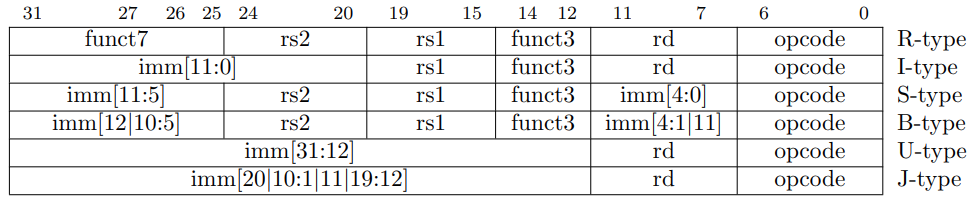
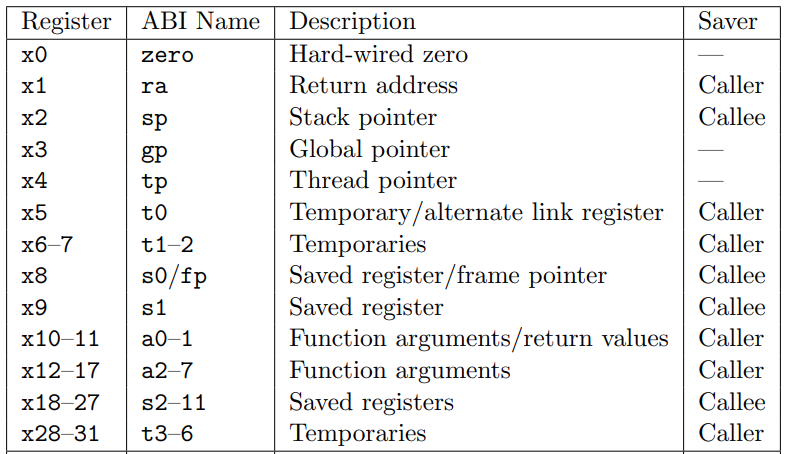
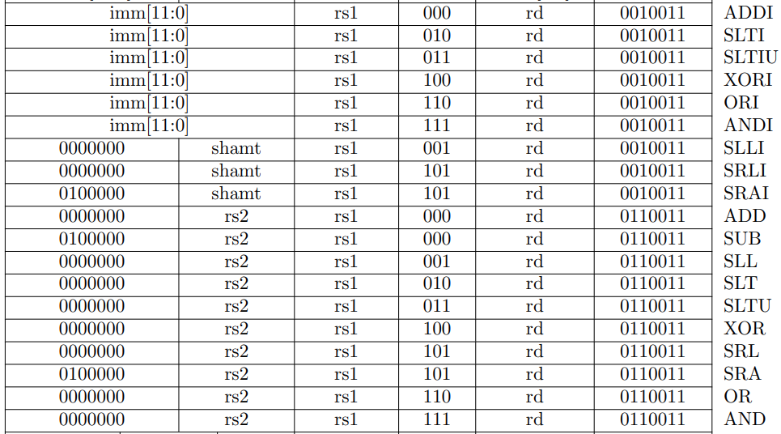
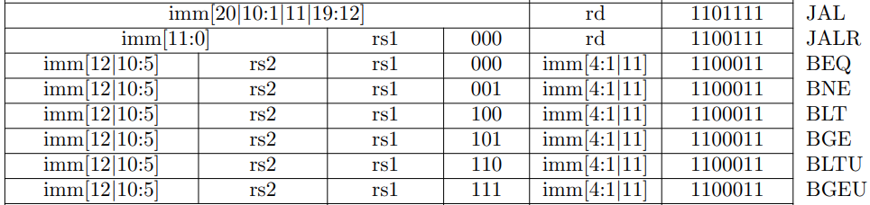
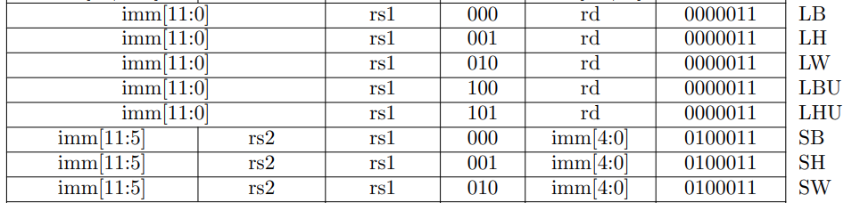
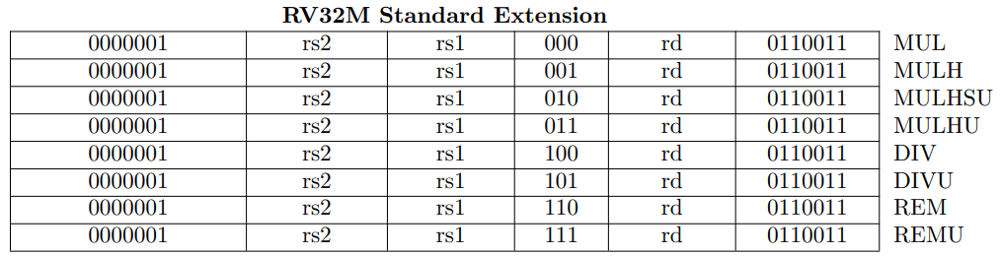

# Codificação de Instruções

Rodolfo Azevedo

MC404 - Organização Básica de Computadores e Linguagem de Montagem

http://www.ic.unicamp.br/~rodolfo/mc404

## Programa Armazenado em Memória

* Computadores armazenam o programa junto com os dados
* Você sabe o que é programa quando o PC aponta para aquela posição
  * Cuidado! O PC não sabe o que é programa
  * É sua responsabilidade manter o PC sempre nos lugares coretos
* Potenciais falhas de segurança nesse ponto
* Sistemas Operacionais restringem partes da memória que podem conter código executável

## RISC-V possui 6 Formatos para Instruções

* **R**: instruções que utilizam 3 registradores
  * add, xor, mul, ...
* **I**: instruções com imediatos, loads
  * addi, lw, jalr, slli
* **S**: instruções de store
  * sw, sb
* **B** ou **SB**: instruções de branch
  * beq, bge, ...
* **U**: Instruções com imediatos grandes
  * lui, auipc
* **J** ou **UJ**: instruções de jump
  * jal

## Formatos Básicos das Instruções

* Toda instrução do processador RISC-V possui um formato específico. 
* Esse formato serve para indicar a forma como os bits precisam ser decodificados.



* Como você decodificaria uma instrução?

## Instruções do tipo R

|31:25|24:20|19:15|14:12|11:7|6:0|
|:---:|:---:|:---:|:---:|:--:|:-:|
| funct7 | rs2 | rs1 | funct3 | rd | opcode |

* **rs1** e **rs2** são os dois registradores que serão lidos
* **rd** é o registrador que será escrito
* **opcode** é o código da operação, fixo em 0b0110011 para instruções do tipo R
* **func7+func3** combinado com o **opcode** indicam a operação a ser realizada

> Quantas instruções do tipo R podem ser codificadas?

## Instruções do tipo I

|31:20|19:15|14:12|11:7|6:0|
|:---:|:---:|:---:|:--:|:-:|
| imm[11:0] | rs1 | funct3 | rd | opcode |

* Somente o campo **imm** é diferente do tipo R
* **opcode** especifica unicamente a instrução
* **rs1** é o registrador que será lido
* **rd** é o registrador que será escrito
* **imm** é um imediato de 12 bits que tem o sinal estendido para 32 bits
  * representa valores no intervalo [-2048, 2047]

## Registradores

Os registradores também estão codificados. Todos possuem um nome X e um número associado.



## Instruções Aritméticas (Tipo R e I)



## Exemplos de Instruções aritméticas

### Codifique as instruções abaixo

* addi s0, s1, 20
* sub a0, a1, a

## Exemplo de Instrução Aritmética: **sub a0, a1, a2**

| funct7[31:25] | rs2[24:20] | rs1[19:15] | funct3[14:12] | rd[11:7] | opcode[6:0] |
|:-------------:|:----------:|:----------:|:-------------:|:--------:|:-----------:|
| 0100000       | 01100      | 01011      | 000           | 01010    | 0110011     |

* a0 = x10
* a1 = x11
* a2 = x12

> Instrução codificada: **40 c5 85 33**

## Exemplo de Instrução Aritmética: **addi s0, s1, 20**

| imm[31:20] | rs1[19:15] | funct3[14:12] | rd[11:7] | opcode[6:0] |
|:----------:|:----------:|:-------------:|:--------:|:-----------:|
| 0000 0001 0100 | 01001      | 000           | 01000    | 0010011     |

* s0 = x8
* s1 = x9

> Instrução codificada: **01 44 84 13**

## Instruções de Salto (Tipo J e I)



## Exemplo de Instrução de Salto: **beq s0, s1, loop**

| imm[12-10:5] | rs2[24:20] | rs1[19:15] | funct3[14:12] | imm[4:1-11] | opcode[6:0] |
|:------------:|:----------:|:----------:|:-------------:|:-----------:|:-----------:|
| 1111 111     | 0 1001     | 0100 0     | 000           | 1100 1      | 110 0011 |

* s0 = x8
* s1 = x9

> Instrução codificada: 0xFE940CE3
> imm: 1 1111 1111 100**0** = 0x1FF8 = -8

## Instruções de Load e Store (Tipo I e S)



## Exemplo de Instrução de Load: **lw a0, 0(s0)**

| imm[11:0] | rs1[19:15] | funct3[14:12] | rd[11:7] | opcode[6:0] |
|:---------:|:----------:|:-------------:|:--------:|:-----------:|
| 000000000000| 01000    | 010           | 01010    | 0000011     |

* a0 = x10
* s0 = x8

> Instrução codificada: **00 04 25 03**

## Exemplo de Instrução de Store: **sw a0, 0(s0)**

| imm[11:5] | rs2[24:20] | rs1[19:15] | funct3[14:12] | imm[4:0] | opcode[6:0] |
|:---------:|:----------:|:----------:|:-------------:|:--------:|:-----------:|
| 0000000   | 01010      | 01000      | 010           | 00000    | 0100011     |

* a0 = x10
* s0 = x8

> Instrução codificada: **00 A4 20 23**

## Instruções de Multiplicação e Divisão

As instruções de multiplicação e divisão são todas do tipo R.



## Exemplo de Instrução de Multiplicação: **mul t0, t1, t2**

| funct7[31:25] | rs2[24:20] | rs1[19:15] | funct3[14:12] | rd[11:7] | opcode[6:0] |
|:-------------:|:----------:|:----------:|:-------------:|:--------:|:-----------:|
| 0000001       | 00111      | 00110      | 000           | 00101    | 0110011     |

* t0 = x5
* t1 = x6
* t2 = x7

> Instrução codificada: **02 73 02 B3**

## Instruções do tipo U (upper immediate)

| 31:12 | 11:7 | 6:0 |
|:-----:|:----:|:---:|
| imm[31:12] | rd | opcode |

* **imm** é um imediato de 20 bits que é utilizado como bits mais significativos.
  * LUI: Load Upper Immediate
  * AUIPC: Add Upper Immediate to PC

## Utilizando LUI para criar imediatos longos

```mipsasm
lui  a0, 0x87654    # a0 = 0x87654000
addi a0, a0, 0x321  # a0 = 0x87654321
```

> Como fazer para gerar 0xDEADBEEF?

## Como fazer para gerar 0xDEADBEEF?

```mipsasm
lui a0, 0xDEADB   # a0 = 0xDEADB000
addi a0, a0,0xEEF # a0 = 0xDEADAEEF
```

A extensão de sinal decrementa o valor superior. A solução é pré-incrementa-lo no LUI.

```mipsasm
lui a0, 0xDEADC   # a0 = 0xDEADC000
addi a0, a0,0xEEF # a0 = 0xDEADBEEF
```

A pseudo-instrução li já trata corretamente desse caso:

```mipsasm
li a0, 0xDEADBEEF # cria as duas instruções corretamente
```
