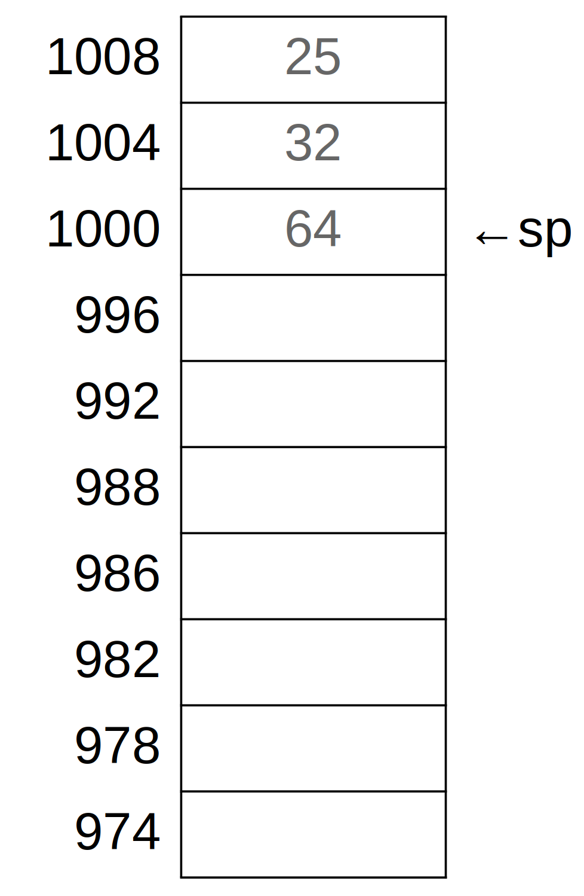

# Revisitando Pilha e Contexto de Execução

Rodolfo Azevedo

MC404 - Organização Básica de Computadores e Linguagem de Montagem

http://www.ic.unicamp.br/~rodolfo/mc404

## O que é e para que serve a pilha

* **O que é?** A pilha é uma estrutura de dados mantida pelo programa para guardar dados de forma temporária e com o conceito de LIFO (Last In, First Out).
* **Para que serve?** A pilha é utilizada para guardar dados temporários, como variáveis locais, endereços de retorno de funções, registradores que precisam ser salvos, etc.
* **Quem é o responsável por gerenciar a pilha?** O seu código é completamente responsável por gerenciar a pilha. O processador não sabe o que é pilha e não faz nada para ajudar.

## Exemplo inicial

```mipsasm
main: addi sp, sp, -4  # libera espaço para 1 registrador
      sw   s0, 0(sp)   # guarda registrador r0
      addi sp, sp, -4  # libera espaço para 1 registrador
      sw   s1, 0(sp)   # guarda registrador r1
      addi sp, sp, -4  # libera espaço para 1 registrador
      sw   ra, 0(s0)   # guarda o endereço de retorno
...
... # muito código por aqui, incluindo a chamada de alguma função
...
      lw   ra, 0(sp)   # recupera o endereço de retorno
      addi sp, sp, 4   # retorna a pilha
      lw   s1, 0(sp)   # recupera o registrador r1
      addi sp, sp, 4   # retorna a pilha
      lw   s0, 0(sp)   # recupera o registrador r0
      addi sp, sp, 4   # retorna a pilha
      ret
``` 

> Complicado ter que cuidar item a item da pilha, não?

## Exemplo inicial economizando alterações no sp

```mipsasm
main: addi sp, sp, -12  # 3 instruções viraram 1
      sw   s0, 8(sp)
      sw   s1, 4(sp)
      sw   ra, 0(s0)
...
... # muito código por aqui
...
      lw   ra, 0(sp)
      lw   s1, 4(sp)
      lw   s0, 8(sp)
      addi sp, sp, 12  # 3 instruções viraram 1
      ret
```

## Exemplo passo a passo

Suponha que `sp = 1000`, `s0 = 20`, `s1 = 30` e `ra = 100`.

```mipsasm
main: addi sp, sp, -12
      sw   s0, 8(sp)
      sw   s1, 4(sp)
      sw   ra, 0(s0)
...
... # muito código por aqui
...
      lw   ra, 0(sp)
      lw   s1, 4(sp)
      lw   s0, 8(sp)
      addi sp, sp, 12
      ret
```



## Exemplo passo a passo 1

Suponha que `sp = 1000`, `s0 = 20`, `s1 = 30` e `ra = 100`.

```mipsasm
main: addi sp, sp, -12  # <---
      sw   s0, 8(sp)
      sw   s1, 4(sp)
      sw   ra, 0(s0)
...
... # muito código por aqui
...
      lw   ra, 0(sp)
      lw   s1, 4(sp)
      lw   s0, 8(sp)
      addi sp, sp, 12
      ret
```


## Exemplo passo a passo 2

Suponha que `sp = 1000`, `s0 = 20`, `s1 = 30` e `ra = 100`.

```mipsasm
main: addi sp, sp, -12
      sw   s0, 8(sp)    # <---
      sw   s1, 4(sp)
      sw   ra, 0(s0)
...
... # muito código por aqui
...
      lw   ra, 0(sp)
      lw   s1, 4(sp)
      lw   s0, 8(sp)
      addi sp, sp, 12
      ret
```


## Exemplo passo a passo 3

Suponha que `sp = 1000`, `s0 = 20`, `s1 = 30` e `ra = 100`.

```mipsasm
main: addi sp, sp, -12 
      sw   s0, 8(sp)
      sw   s1, 4(sp)   # <---
      sw   ra, 0(s0)
...
... # muito código por aqui
...
      lw   ra, 0(sp)
      lw   s1, 4(sp)
      lw   s0, 8(sp)
      addi sp, sp, 12
      ret
```


## Exemplo passo a passo 4

Suponha que `sp = 1000`, `s0 = 20`, `s1 = 30` e `ra = 100`.

```mipsasm
main: addi sp, sp, -12
      sw   s0, 8(sp)
      sw   s1, 4(sp)
      sw   ra, 0(s0)   # <---
...
... # muito código por aqui
...
      lw   ra, 0(sp)
      lw   s1, 4(sp)
      lw   s0, 8(sp)
      addi sp, sp, 12
      ret
```


## Exemplo passo a passo 5

Suponha que `sp = 1000`, `s0 = 20`, `s1 = 30` e `ra = 100`.

```mipsasm
main: addi sp, sp, -12
      sw   s0, 8(sp)
      sw   s1, 4(sp)
      sw   ra, 0(s0)
...
... # muito código por aqui
...
      lw   ra, 0(sp)   # <---
      lw   s1, 4(sp)
      lw   s0, 8(sp)
      addi sp, sp, 12
      ret
```


## Exemplo passo a passo 6

Suponha que `sp = 1000`, `s0 = 20`, `s1 = 30` e `ra = 100`.

```mipsasm
main: addi sp, sp, -12
      sw   s0, 8(sp)
      sw   s1, 4(sp)
      sw   ra, 0(s0)
...
... # muito código por aqui
...
      lw   ra, 0(sp)
      lw   s1, 4(sp)  # <---
      lw   s0, 8(sp)
      addi sp, sp, 12
      ret
```


## Exemplo passo a passo 7

Suponha que `sp = 1000`, `s0 = 20`, `s1 = 30` e `ra = 100`.

```mipsasm
main: addi sp, sp, -12
      sw   s0, 8(sp)
      sw   s1, 4(sp)
      sw   ra, 0(s0)
...
... # muito código por aqui
...
      lw   ra, 0(sp)
      lw   s1, 4(sp)
      lw   s0, 8(sp)  # <---
      addi sp, sp, 12
      ret
```


## Exemplo passo a passo 8

Suponha que `sp = 1000`, `s0 = 20`, `s1 = 30` e `ra = 100`.

```mipsasm
main: addi sp, sp, -12
      sw   s0, 8(sp)
      sw   s1, 4(sp)
      sw   ra, 0(s0)
...
... # muito código por aqui
...
      lw   ra, 0(sp)
      lw   s1, 4(sp)
      lw   s0, 8(sp)
      addi sp, sp, 12 # <---
      ret
```


## Algumas conclusões

* O apontador de pilha `sp` aponta para um local que contém dado (convenção)
* Você pode atualizar o apontador da pilha em múltiplas unidades de uma única vez
* Os dados gravados na pilha ficam lá até que outra coisa seja escrita na mesma posição
* Todo o gerenciamento da pilha é feito por código do programador

## O que fazer quando tiver mais de 8 parâmetros?

* A convenção do RISC-V prevê 8 registradores para parâmetros (`a0` até `a7`)
* Quando precisar passar mais parâmetros, eles devem ser passados na pilha em ordem inversa

```mipsasm
  li   a0, 1
  li   a1, 2
  li   a2, 3
  li   a3, 4
  li   a4, 5
  li   a5, 6
  li   a6, 7
  li   a7, 8
  addi sp, sp, -8
  sw   s0, 4(sp)  # décimo parâmetro
  sw   s1, 0(sp)  # nono parâmetro
  call Função_Com_Muitos_Parâmetros
  ```

## Variáveis locais na pilha

* Sempre que possível, priorize colocar variáveis em registradores!
* Quando não for possível, coloque na pilha
  * Casos típicos são strings, vetores ou estruturas
* Aloque espaço extra na pilha e coloque esses dados
  * Faça de forma similar ao que já faz para registradores, decrementando o `sp` corretamente

## Exemplo de alocação de variáveis na pilha

Escreva uma função que receba um parâmetro N, leia N números e retorne quantos deles são maiores que a média.

```mipsasm
main: #...
      li    a0, 4
      call  N_Maiores_Que_Media  # Está no endereço 96 de memória
      #...
      ret
```

Considere que existam as funções: `void LeVetor(int *v, int N)`, `int LeNumero()` e `int Media(int *v, int N)`.

## Exemplo de alocação de variáveis na pilha (resolvido)

```mipsasm
N_Maiores_Que_Media: 
  addi sp, sp, -16
  sw   s0, 12(sp)
  sw   s1, 8(sp)
  sw   s2, 4(sp)
  sw   ra, 0(sp)

  slli t0, a0, 2  # Multiplica a0 por 4 (bytes)
  sub  sp, sp, t0 # Aloca o vetor na pilha
  
  mv   s0, a0  # N

  mv   a0, sp
  mv   a1, s0
  call LeVetor   # (v, N)

  mv   a0, sp
  mv   a1, s0
  call Media     # (v, N)
```

## Continuando

```mipsasm

  mv   s1, sp  # v
  mv   s2, a0  # Guarda a média
  li   a0, 0
  mv   t1, s0  # N

  loop: lw   t0, 0(s1)
        ble  t0, s2, menor
        addi a0, a0, 1
    menor:
        addi s1, s1, 4
        addi t1, t1, -1
        bne  t1, zero, loop

  slli t0, s0, 2  # Multiplica N por 4 (bytes)
  add  sp, sp, t0 # Desaloca o vetor da pilha
  lw   ra, 0(sp)
  lw   s2, 4(sp)
  lw   s1, 8(sp)
  lw   s0, 12(sp)
  addi sp, sp, 16
  ret
```

## Como fica a pilha nesse caso?

Suponha que:

* `sp = 1000`
* `s0 = 20`
* `s1 = 30`
* `s2 = 40`
* `ra = 100`

# Antes de ler o vetor

Suponha que:

* `sp = 1000`
* `s0 = 20`
* `s1 = 30`
* `s2 = 40`
* `ra = 100`


# Após ler o vetor

Suponha que:

* `sp = 1000`
* `s0 = 20`
* `s1 = 30`
* `s2 = 40`
* `ra = 100`
* vetor = [2, 4, 6, 8]


## O que acontece se a função `LeVetor` ler um elemento a mais?

* Imagine que houve um bug no código e a função `LeVetor` leu um elemento a mais

## Resposta

* Esse problema se chama **buffer overflow** e é uma das famílias de bugs mais comuns em programação
* No exemplo ao lado, foram lidos 5 números e o último foi colocado na posição `sp + 20`
* Essa posição tinha o valor anterior do registrador `ra`
* Para onde sua função vai retornar?


