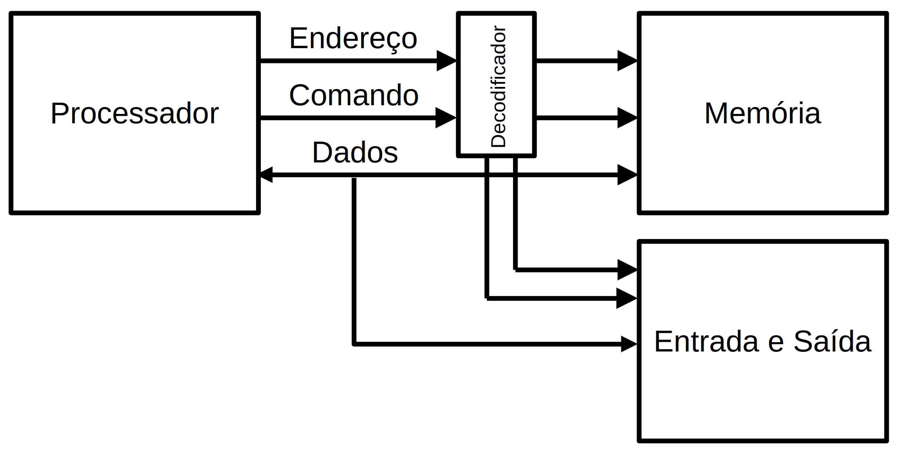
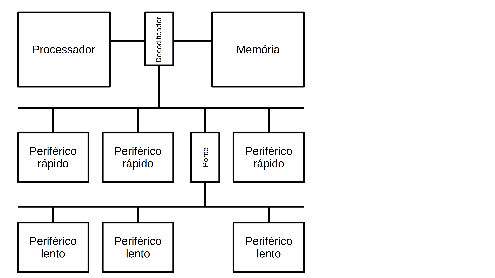

# Interação com Sistema Operacional

Rodolfo Azevedo

MC404 - Organização Básica de Computadores e Linguagem de Montagem

http://www.ic.unicamp.br/~rodolfo/mc404

## Entrada e Saída


* O modelo anteriormente visto é muito simples e não permite que o processador interaja com o mundo externo.
* Para resolver esse desafio, existem duas opções de interfaces entre o processador e mundo externo:
  * Espaço de Endereçamento único
  * Espaço de Endereçamento separado

## Espaço de Endereçamento Único



* O processador apenas enxerga um único espaço de endereçamento, que contém tanto a memória quanto os periféricos.
* As mesmas instruções podem acessar memória e periféricos (`lw`e `sw`)

## Espaço de Endereçamento Separado


* O processador enxerga dois espaços de endereçamento distintos, um para memória e outro para periféricos.
* Existem instruções distintas para acessar cada um dos endereços:
  * `lw` e `sw` para memória
  * `in` e `out` para periféricos (caso do x86)

## Prós e Contras

### Espaço de Endereçamento Unificado

* Simplicidade na visão do sistema e nas rotinas de acesso externos
* Dificuldade de diferenciar código de entrada e saída de código de memória
* Utilização do mesmo mecanismo de proteção de memória para entrada e saída

### Espaço de Endereçamento Separado

* Diferenciação clara entre código de entrada e saída e código de memória
* Necessidade de instruções distintas para acesso a memória e periféricos
* Necessidade de mecanismos de proteção de memória distintos para memória e periféricos

## Como isso se expande para um processador atual?


 
## Chamadas de Serviços do Sistema Operacional

* O Sistema Operacional é o responsável por gerenciar os periféricos e a memória
* Ele é responsável por garantir que os programas não acessem periféricos ou memória de forma indevida
  * Um programa/processo não pode ler a memória de outro
  * Um programa/processo não pode ler/escrever em um periférico diretamente sem a gestão do Sistema Operacional
* Para isso, o Sistema Operacional disponibiliza uma interface para que os programas possam requisitar serviços
  * Essa interface é chamada de **Chamadas de Serviços do Sistema Operacional** ou **System Calls**
  * Vocês já utilizaram as `ecall` do RISC-V nesse semestre

## Padronizações e Convenções

* As chamadas de sistema podem variar conforme:
  * O Sistema Operacional utilizado
  * O simulador utilizado (as vezes segue um SO, outras cria regras próprias)
  * O grau de complexidade do ambiente simulado
* Nunca deixe de consultar os manuais/referências para saber como utilizar as chamadas de sistema

## Exceções e Interrupções

* Eventos que podem causar a transferência da execução para outra parte do código, tipicamente para o Sistema Operacional

### Exceções

* Causas internas ao core
* Divisão por zero, falha de página, etc

### Interrupções

* Causas externas ao core
* Movimento do mouse, tecla digitada, dados prontos da rede ou disco

> As rotinas de tratamento são similares, focaremos em interrupções

## Como tratar uma interrupção?

### Quais são as alternativas?

* O processador ou o seu programa pode ficar perguntando o status de cada periférico
  * Mecanismo similar ao que você fez ao ler do teclado
  * Custo de ficar testando o tempo inteiro enquanto poderia estar fazendo outra tarefa
* O periférico pode avisar o processador quando estiver pronto
  * Mecanismo de interrupção
  * O periférico avisa o processador quando estiver pronto
  * O processador interrompe o programa atual e executa uma rotina de tratamento de interrupção

## Espera ocupada

* Também chamada de **polling** ou **busy waiting**
* Funciona quando há baixa transferência de dados e sabe-se de antemão que o periférico vai transferir dados.
  * Você fez isso ao ler do teclado
  * Não havia mais nada para seu programa fazer
  * Você sabia que o teclado iria enviar dados
  * Você ficou testando o teclado (ou chamando o sistema operacional) até que ele enviasse dados
* Funciona sempre na forma de um laço, onde o processador fica testando o periférico até que ele esteja pronto
* Útil para poucos dados
* Alternativa para volumes imensos de dados previsíveis

## Interrupções

* O programa/sistema operacional configura o periférico para avisar quando um evento aconteceu
  * O usuário moveu o mouse
  * Uma tecla foi apertada
  * Chegou um pacote de rede
  * Um disco/ssd está pronto para transferir dados
* O periférico avisa o processador quando o evento acontece
* Uma rotina de tratamento de interrupção é executada
* O processador volta a executar o programa que estava sendo executado

## Como interromper um processador

* Um sinal elétrico ou mensagem pelo barramento é enviado ao processador
* O processador interrompe a execução do programa atual
  * Salva o estado do programa atual (que estado?)
  * Executa uma rotina de tratamento de interrupção
  * Restaura o estado do programa atual
* Existem múltiplas formas de tratamento de interrupção
  * Vetor de interrupção
  * Vetor de rotinas de interrupção
  * Tratador único de interrupção

## Vetor de Interrupção

* Cada interrupção tem um identificador numérico único
* O processador possui, em memória, um vetor com endereços das rotinas de tratamento de interrupção
* Ao receber uma interrupção, o processador consulta o vetor e salta para o endereço indicado
* O tratador de interrupção é responsável por identificar detalhes da causa e realizar o tratamento adequado
* Esse mecanismo tem a vantagem de ter rotinas simplificadas (específicas) de tratamento
* É possível colocar o mesmo tratador em múltiplas entradas do vetor

## Vetor de Rotinas de Interrupção

* Ao invés de um vetor de endereços, tem-se um vetor de pequenas rotinas de tratamento
  * O tamanho máximo da rotina é definido. Ex.: 4 instruções
  * Para rotinas maiores, salta-se para outro lugar da memória
* O vetor de rotinas é indexado pelo identificador da interrupção
* Funciona de forma similar ao vetor de interrupção
* Quando não possuir tratador, a própria rotina retorna imediatamente

## Tratador Único de Interrupção

* O processador possui um único tratador de interrupção
* O tratador é responsável por identificar a causa da interrupção e executar o tratamento adequado
* A causa é armazenada num registrador especial do processador que é consultado ao executar a rotina de tratamento
* Simplifica o processo de início do tratamento de interrupção mas exigte uma estrutura estilo `switch` para identificar a causa

## Como salvar o estado de um processador quando acontece uma interrupção?

## Salvando o estado do processador

* Todos os registradores de uso geral podem estar ocupados (`x1` a `x31`)
* O processador precisa salvar o estado de todos eles
* O processador precisa salvar o endereço atual de execução (`pc`)
* Existem registradores extras para fazer a gestão de interrupções
  * Registrador de causa
  * Registrador de endereço de retorno
  * Registrador de reserva

## Registradores de estado do processador

* Os registradores de estado do processador são chamados de CSR (Control Status Register)
  * `csrr` lê um registrador de status, `csrw` escreve um registrador de status e `csrrw` lê e escreve um registrador de status
  * `mtvec` é o registrador de endereço de tratamento de interrupção
  * `mepc` é o registrador que contém o `pc` do endereço da interrupção
  * `mcause` é o registrador que contém a causa da interrupção
  * `mtval` contém informações extras sobre a interrupção (depende da causa)
  * `mscratch` é um registrador de uso geral que pode ser usado para salvar o estado do processador (rascunho)

## Uma rotina de tratamento de interrupção

* Inicia com o `mepc`, `mcause` e `mtval` com informações sobre a interrupção
* Salva algum registrador do processador em `mscratch`
* Utiliza esse registrador para apontar para uma posição segura de memória
* Salva os demais registradores nessa região de memória (inclusive o `sp`)
* Define uma nova pilha
* Executa a rotina de tratamento
* Retorna os registradores para seus valores originais
* Copia `mtvec` para `pc`

## Integração de assembly com outras linguagens

* O assembly é uma linguagem de baixo nível
* É possível integrar código assembly com código de outras linguagens
* As convenções de chamadas de funções são as mesmas para assembly e outras linguagens
* Escreva seu código de forma **bem comportada** e ele pode ser integrado com outras linguagens

## Exemplo

```C
#include <stdio.h>

int main()
{
  puts("Hello World!\n");
}
```

compilado com:

```bash
$ riscv64-linux-gnu-gcc hello.c -S hello.s
```

## Convertido para assembly (hello.s)

```mipsasm
	.file	"hello.c"
	.option pic
	.attribute arch, "rv64i2p1_m2p0_a2p1_f2p2_d2p2_c2p0_zicsr2p0_zifencei2p0"
	.attribute unaligned_access, 0
	.attribute stack_align, 16
	.text
	.section	.rodata
	.align	3
.LC0:
	.string	"Hello World!\n"
	.text
	.align	1
	.globl	main
	.type	main, @function
main:
	addi	sp,sp,-16
	sd	ra,8(sp)
	sd	s0,0(sp)
	addi	s0,sp,16
	lla	a0,.LC0
	call	puts@plt
	li	a5,0
	mv	a0,a5
	ld	ra,8(sp)
	ld	s0,0(sp)
	addi	sp,sp,16
	jr	ra
	.size	main, .-main
	.ident	"GCC: (Ubuntu 12.2.0-14ubuntu2) 12.2.0"
	.section	.note.GNU-stack,"",@progbits
```