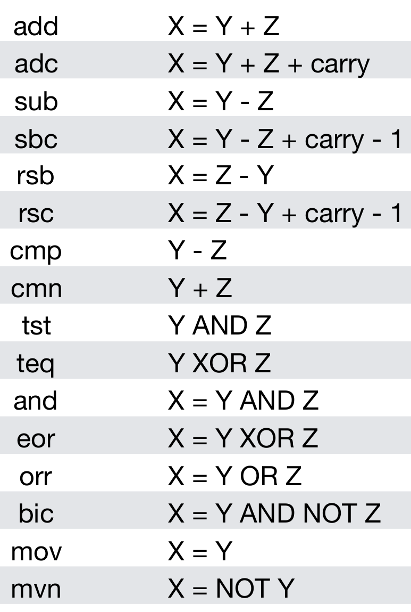
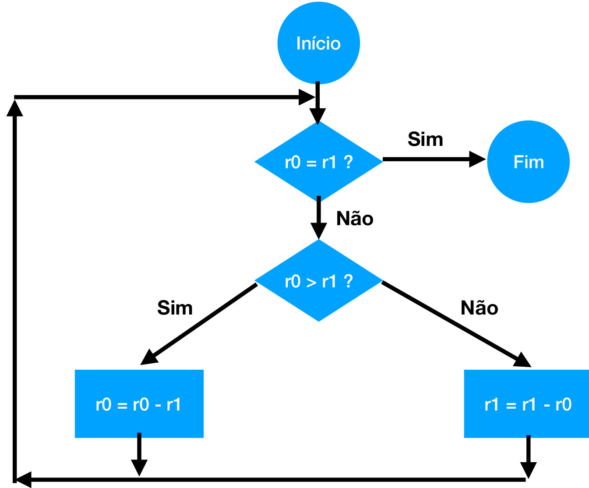
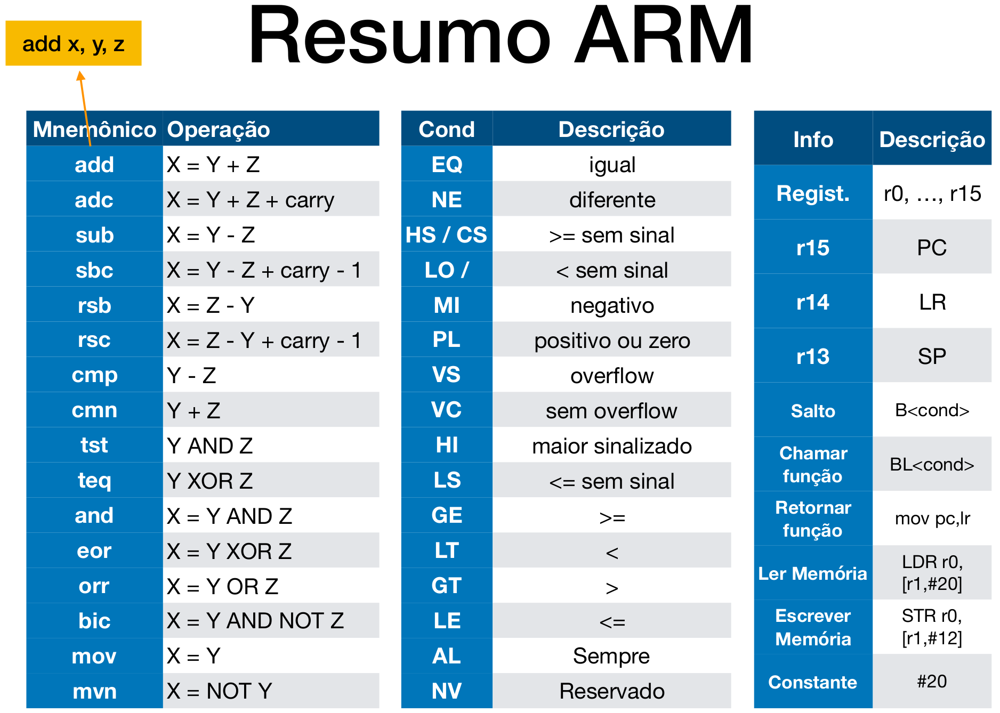

# Outras implementações de Assembly

Rodolfo Azevedo

MC404 - Organização Básica de Computadores e Linguagem de Montagem

http://www.ic.unicamp.br/~rodolfo/mc404

## ARM e x86

* São as duas arquiteturas mais utilizadas hoje em dia
  * x86 em computadores/servidores
  * ARM em sistemas embarcados em geral
* Os usos estão se expandindo
* Os slides a seguir contam um pouco do assembly de cada uma delas
  * Atenção para a questão cronológica: o x86 é mais antigo que o ARM. O RISC-V é o mais novo de todos.
  * Você viu RISC-V primeiro, então algumas comparações serão feitas nessa direção

## ARM

* Processador mais utilizado no mundo
* Assembly com grande variedade de instruções
* Diversas versões do processador
* Várias extensões ao conjunto de instruções
* Versões de 32 e 64 bits

## Registradores

* 16 registradores de uso geral: r0, r1, … r15
* Convenção de uso
* 13 de uso geral: r0 … r12
* 3 de uso especial: r13, r14, r15
  * SP: r13
  * LR: r14
  * PC: r15

* Atenção para o PC como um registrador de uso geral
  * Registrador de 32 bits com os últimos bits zerados

## Instruções Básicas



* Formato geral similar ao RISC-V
* Exemplos:
  * add r1, r2, r3
  * add r1, r2, #50
* Note instruções com carry (vai um)
* Não há distinção de mnemônicos para imediato ou não

## Execução condicional

* Toda instrução de 32 bits pode ser condicional
* Você sempre pode adicionar uma instrução de comparação e executar, daí em diante, as demais instruções condicionalmente
* São 16 sufixos de condições. Os principais são:
  * EQ: igual
  * NE: diferente
  * GT: maior
  * LT: menor
  * GE: maior ou igual
  * LE: menor ou igual
  * AL: sempre (default)

## Instruções de salto

* B<condição> destino
  * Salta para o destino (similar ao RISC-V)
* BL<cond> função
  * Equivalente al CALL, guarda o endereço de retorno no LR
* MOV PC, LR
  * Equivalente ao RET

## Exemplo: Maior Divisor Comum



## Maior Divisor Comum (duas implementações)

* Original
```
gcd:   cmp r0, r1
       beq fim
       blt menor
       sub r0, r0, r1
       bal gcd
menor: sub r1, r1, r0
       bal gcd 
fim:
```

* ARM com condicional
```
gcd:  cmp   r0, r1
      subgt r0, r0, r1
      sublt r1, r1, r0
      bne   gcd
```

## Load e Store

* Como o RISC-V, somente instruções explícitas de acesso à memória conseguem ler e escrever dados na memória
* Load: Lê dados da memória
  * LDR ou LDM
* Store: Escreve dados na memória
  * STR ou STM

## Exemplos

* ```ldr r0, [r1, #12]```
  * Supondo r1 = 20, acessa a posição 32 (=20+12) de memória e guarda o valor no registrador r0.
* ```str r5, [r9, #-20]```
  * Supondo r9 = 100, grava o valor do registrador r5 na posição 80 (=100-20) de memória.
* Se incluir uma exclamação (!) após a instrução, atualiza o registrador de índice (r1, r9) pela constante fornecida.

## Acesso Múltiplo à memória

* STM e LDM executam mais de uma operação de memória.
* Precisam de um sufixo para indicar a direção desejada do acesso à memória:
  * Endereço crescente ou decrescente
  * Posição inicial preenchida ou não preenchida

* LDM<sufixo> r1, {r0, r2, r3}
* STM<sufixo> r1, {r0, r2, r3}

* Facilita a implementação da pilha ao utilizar o sufixo FD
  * ```STMFD r13!, {r4-r7}```
  * ```LDMFD r13!, {r4-r7}```
* A esclamação atualiza o registrador de índice com o último valor

---


## Arquitetura x86

* Disponível nas versões 16 bits, 32 bits e 64 bits
* Apesar da inclusão de novas instruções e registradores, o assembly foi sendo simplificado
  * Existem inúmeras restrições de uso de registradores no modo 16 bits que foram sendo relaxados
* Instruções tipicamente de dois endereços:
  * X = X op Y
* As instruções podem acessar diretamente a memória sem a necessidade de LW ou SW como no RISC-V

## Registradores

* Considerando o modo de 16 bits, existem 8 registradores de uso geral
  * AX, BX, CX, DX, SI, DI, BP, SP
  * Os 4 primeiros podem ser divididos em H e L: AH e AL, BH e BL, CH e CL, DH e DL
* Considerando o modo de 32 bits, existem 8 registradores de uso geral
  * EAX, EBX, ECX, EDX, ESI, EDI, EBP, ESP
* Considerando o modo de 64 bits, existem 16 registradores de uso geral
  * RAX, RBX, RCX, RDX, RSI, RDI, RBP, RSP, R8, R9, R10, R11, R12, R13, R14, R15

## Modos de endereçamento

* Os modos de endereçamento são mais complexos que no RISC-V
* Existem muitas variações de endereçamento conforme o exemplo abaixo utilizando a instrução MOV (copia o dado da direita para esquerda):

```
mov [edx],                      eax
mov [ebx+ebp],                  eax
mov [esi+edi],                  eax
mov [esp+ecx],                  eax
mov [ebx*4 + 0x1a],             eax
mov [ebx + ebp*8 + 0xab12cd34], eax
mov [esp + ebx*2],              eax
mov [0xffffaaaa],               eax

mov [esp*2], eax
```

## Pilha

* A pilha é implementada utilizando o registrador SP
* Duas instruções especiais:
  * ```PUSH``` empilha o valor de um registrador
  * ```POP``` desempilha o valor para um registrador

## Instruções de salto

* As instruções de salto são similares ao RISC-V
* ```JMP``` para salto incondicional para um endereço
* Instruções de salto condicional
  * ```JE```: igual
  * ```JNE```: diferente
  * ```JG```: maior
  * ```JL```: menor
  * ```JGE```: maior ou igual
  * ```JLE```: menor ou igual
* As instruções de salto condicional são baseadas no resultado de uma operação anterior, que pode ser ```CMP``` ou uma aritmética qualquer

## Funções

* Instrução ```CALL``` para chamar uma função
* Instrução ```RET``` para retornar de uma função

* O padrão original é passar parâmetros pela pilha com ```PUSH``` e ```POP```
* A ```CALL``` empilha o endereço de retorno
* A ```RET``` desempilha o endereço de retorno

## Algumas instruções

* As instruções de 2 endereços operam sobre os dois parâmetros e guardam a resposta no primeiro
* ```MOV``` copia o dado da direita para esquerda
* ```ADD``` / ```SUB``` soma/subtrai o dado da direita do da esquerda
* ```INC``` / ```DEC``` incrementa/decrementa o registrador
* ```CMP``` compara os dois dados e atualiza o registrador de flags
* ```AND``` / ```OR``` / ```XOR``` operações lógicas
* ```NOT``` / ```NEG``` operações lógicas unárias
* ```MULT``` / ```DIV``` multiplicação e divisão
* ```XCHG``` troca o conteúdo de dois registradores
* ```SHL``` / ```SHR``` deslocamento de bits para esquerda e direita

## Movimentando bytes/palavras

* x86 possui instruções específicas para facilitar a cópia de dados da memória
  * ```MOVSB```: copia um byte
  * ```MOVSW```: copia uma palavra (2 bytes)
  * ```MOVSD```: copia um double word (4 bytes)
  * ```MOVSQ```: copia um quad word (8 bytes)
* Os registradores SI e DI são utilizados para indicar a origem e destino da cópia e são incrementados automaticamente
* Pode utilizar um prefixo de repetição para repetir a operação, supondo CX=20
  * ```REPCXZ MOVSB```: copia 20 bytes

## Conclusões

* As arquiteturas são diferentes e as instruções também
* Não existe um **assembly** universal
* Se você quer escrever no currículo, especifique a arquitetura
* Desconfie de quem escrever que sabe **assembler** ao invés de **assembly**
* As ideias gerais e granularidade são as mesmas, você terá que quebrar suas tarefas em instruções que fazem pouca coisa por vez, independente da arquitetura
* Uma forma básica de se familiarizar com o assembly de uma arquitetura é pedindo ao compilador para gera-lo para você, passando a opção -S ao gcc por exemplo
