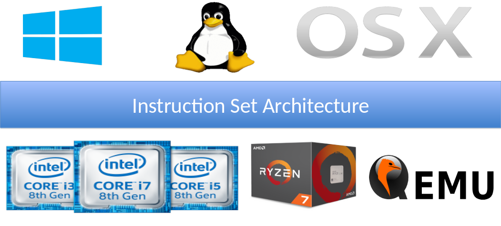

# Conjuntos de Instruções - ISA

* *"The portion of the computer that is visible to the programmer or the compiler writer."* - Computer Architecture: A quantitative approach

* *"An instruction set architecture (ISA) is an abstract model of a computer. It is also referred to as architecture or computer arquiteture."* - Wikipedia

* *"A contract HW and SW designers agreed to obey"* - Minha definição de uma linha

* **"Um contrato em que os projetistas de hardware e software concordaram em obedecer"** - Minha definição de uma linha

# Arquitetura vs Microarquitetura

* Arquitetura é o modelo
  * x86, ARM, RISC-V, Power

* Microarquitetura é a implementação
  * Intel i7 geração 11, AMD Ryzen 3, ARM Cortex-A53, RISC-V RV32IMAC, PowerPC 970

* Conjunto de instruções pode ser visto como a borda
  * Pode facilitar ou dificultar a implementação em cada um dos lados

# ISA é importante?



# Ambientes de Execução

* Plataforma Bare metal (Arduino)
  * Sem sistema operacional
  * Acesso direto aos periféricos
  * Programa é executado diretamente na memória
* Sistema Operacional (Windows, Linux, iOS, Android)
  * Acesso indireto aos periféricos
  * Programa é executado em um processo
* Hypervisor (VirtualBox, VMware, QEMU)
  * Acesso indireto aos periféricos
  * Programa é executado em uma VM
* Emulador (MARS, QEMU)
  * Acesso indireto aos periféricos
  * Programa é executado em um processo

# RISC-V: Características gerais

* Conjunto de instruções
  * Aberto
  * Modularizado
  * Virtualizável
* Licença de uso
  * Aberta
  * Não patenteada
* Espaço de endereçamento de **32**, 64 ou 128 bits
* Registradores de **32**, 64 ou 128 bits

# Extensões

| Extensão | Característica |
|---|---|
| RV32I | Conjunto base de instruções de inteiros de 32 bits |
| RV64I | Conjunto base de instruções de inteiros de 64 bits |
| M | Instruções de multiplicação e divisão de inteiros |
| A | Instruções de operações atômicas |
| F e D| Instruções de ponto flutuante de precisão simples e dupla|
| G | Equivalente a IMAFD |
| C | Instruções compactas |

# Os 32 registradores

| Registrador | Descrição |
|---|---|
| zero  | Valor fixo em zero (0) |
| ra    | Endereço de retorno de chamada |
| sp, gp, tp | Apontador de pilha, dados globais e de thread|
| t0-t6 | Valores temporários |
| s0-s11| Valores salvos |
| a0-a7 | Argumentos e valores de retorno |
| pc    | Contador de programa |  

# Formatos básicos das instruções

* mnemônico, rd, rs1, rs2
```mipsasm
ADD s0, s1, s2
```
* mnemônico rs, rs1, imm
```mipsasm
ADD s0, s1, 9
```
* mnemônico rd, imm
```mipsasm
LUI s0, 9
```

# Instruções Aritméticas

| Instrução | Formato | Uso |
|---|---|---|
| ADD | R | ADD rd, rs1, rs2 |
| ADD imediato | I | ADDI rd, rs1, imm |
| SUBtract | R | SUB rd, rs1, rs2 |
| Load Upper Immediate | U | LUI rd, imm |
| Add Upper Immediate to PC | U | AUIPC rd, imm |

# Exemplos

* x = y + z

  ```mipsasm
  add t0, t1, t2   # onde t0 deve ter o valor de x, t1 de y e t2 de z
  ```

* x = x + y
    
  ```mipsasm
  add t0, t0, t1   # onde t0 deve ter o valor de x e t1 de y
  ```

* x = y + 7
    
  ```mipsasm
  addi t0, t1, 7   # onde t0 deve ter o valor de x, t1 de y
  ```

# Continuação dos exemplos

* x = y - z

  ```mipsasm
  sub t0, t1, t2   # onde t0 deve ter o valor de x, t1 de y e t2 de z
  ```

* x = x - y
    
  ```mipsasm
  sub t0, t0, t1   # onde t0 deve ter o valor de x e t1 de y
  ```

* x = y - 7
    
  ```mipsasm
  addi t0, t1, -7   # onde t0 deve ter o valor de x, t1 de y
  ```

# Instruções Lógicas

| Instrução | Formato | Uso |
|---|---|---|
| XOR | R | XOR rd, rs1, rs2 |
| XOR immediato | I | XORI rd, rs1, imm |
| OR | R | OR rd, rs1, rs2 |
| OR immediato | I | ORI rd, rs1, imm |
| AND | R | AND rd, rs1, rs2 |
| AND immediato | I | ANDI rd, rs1, imm |


# Exemplos

* x = y AND z
  
```mipsasm
and t0, t1, t2   # onde t0 deve ter o valor de x, t1 de y e t2 de z
```

* x = x AND y
    
```mipsasm
and t0, t0, t1   # onde t0 deve ter o valor de x e t1 de y
```

* x = y AND 7
    
```mipsasm
andi t0, t1, 7   # onde t0 deve ter o valor de x, t1 de y
```

# Continuação dos exemplos

* x = y XOR z

```mipsasm
xor t0, t1, t2   # onde t0 deve ter o valor de x, t1 de y e t2 de z
```

* x = x OR y
    
```mipsasm
or t0, t0, t1   # onde t0 deve ter o valor de x e t1 de y
```

* x = y OR 7
    
```mipsasm
ori t0, t1, 7   # onde t0 deve ter o valor de x, t1 de y
```

# Instruções de Deslocamento

| Instrução | Formato | Uso |
|---|---|---|
| Shift left logical | R | SLL rd, rs1, rs2 |
| Shift left logical imediato | I | SLLI rd, rs1, shamt |
| Shift right logical | R | SRL rd, rs1, rs2 |
| Shift right logical imediato | I | SRLI rd, rs1, shamt |
| Shift right arithmetic | R | SRA rd, rs1, rs2 |
| Shift right arithmetic imediato | I | SRAI rd, rs1, shamt |

# Exemplos

* x = 2; y = 16; z = -8
* x = x << 5
  
```mipsasm
slli t0, t0, 5   # onde t0 deve ter o valor de x
```

* x = y >> 3
    
```mipsasm
srli t0, t1, 3   # onde t0 deve ter o valor de x e t1 de y
```

* x = z >> 2
      
```mipsasm
srai t0, t2, 2   # onde t0 deve ter o valor de x e t2 de z
```

# Instruções de Memória

| Instrução | Formato | Uso |
|---|---|---|
| Load word | I | LW rd, rs1, imm |
| Store word | S | SW rs2, rs1, imm |

* Existem variações para Byte (LB e SB) e Halfword (LH e SH)
* Também existem variações para Unsigned (LBU e LHU)

# Exemplo

* Somar os dois primeiros elementos do vetor v e guardar na terceira posição do vetor

```mipsasm
lw t1, t0, 0   # onde t0 deve ter o endereço de v[0]
lw t2, t0, 4   
add t3, t1, t2
sw t3, t0, 8   
```

# Tamanho de variáveis

| Linguagem C | Tipo em RISC-V (32 bits) | Tamanho em bytes |
|---|---|---|
| bool | byte | 1 |
| char | byte | 1 |
| short | halfword | 2 |
| int | word | 4 |
| long | word | 4 |
| void | unsigned word | 4 |

* *char*, *short*, *int* e *long* também podem ser unsigned

# Instruções de comparação

| Instrução | Formato | Uso |
|---|---|---|
| Set less than | R | SLT rd, rs1, rs2 |
| Set less than immediate | I | SLTI rd, rs1, imm |
| Set less than unsigned | R | SLTU rd, rs1, rs2 |
| Set less than unsigned immediate | I | SLTIU rd, rs1, imm |

# Exemplo

* Como saber se i < j? 

```mipsasm
slt t0, t1, t2   # onde t1 deve ter o valor de i, t2 de j e t0 terá o resultado
```

* Se i < 0
  * t0 = 1
* Caso contrário
  * t0 = 0

# Instruções de saltos condicionais

| Instrução | Formato | Uso |
|---|---|---|
| Branch if == | SB | BEQ rs1, rs2, label |
| Branch if != | SB | BNE rs1, rs2, label |
| Branch if < | SB | BLT rs1, rs2, label |
| Branch if >= | SB | BGE rs1, rs2, label |
| Branch if < unsigned | SB | BLTU rs1, rs2, label |
| Branch if >= unsigned | SB | BGEU rs1, rs2, label |

:warning: Você pode inverter a ordem dos operandos se necessário!

# Exemplo

* Se x == 0, some z = y + 5, caso contrário z = y + 7

```mipsasm
# supondo que t0 tenha o valor de x, t1 de y e t2 de z
    beq t0, zero, e_zero
    addi t2, t1, 7
    j fim
e_zero: 
    addi t2, t1, 5
fim:
```

# Instruções de salto

| Instrução | Formato | Uso |
|---|:---:|---|
| Jump and link | UJ | JAL rd, label |
| Jump and link register | UJ | JALR rd, rs1, imm |


# Instruções de sistema

| Instrução | Formato | Uso |
|---|:---:|---|
| Environment Call | I | ECALL |
| Environment Breakpoint | I | EBREAK |
| Environment Return | I | ERET |


# Pseudo-instruções

> Pseudo-instruções não são instruções reais, mas são úteis para escrever código mais legível. O montador converteem uma ou mais instruções reais

| Instrução | Descrição | Conversão |
|---|---|---|
| li a0, constante | Carrega uma constante em um registrador | Utiliza lui + addi para compor a constante |
| la a0, label | Carrega o endereço de uma label em um registrador | Utiliza auipc, mv e ld se necessário |
| mv a0, a1 | Move o valor de um registrador para outro | Utiliza addi |

# Outros exemplos de pseudo-instruções

| Instrução | Descrição | Conversão |
|---|---|---|
| call label | Chama uma função | Utiliza jal ou jalr|
| nop | Nenhuma operação | Utiliza addi zero, zero, 0 |
| j destino | Salta para um destino | Utiliza jal zero, 0 |
| ret | Retorna de uma função | Utiliza jalr zero, ra 0 |
| not rd, rs | Inverte os bits de um registrador | xori rd, x0, rs |

# Exemplos de código em alto nível  vs Assembly

Para cada código em C, faça uma implementação em assembly para o RISC-V


# if then else

```c
if (x == 5)
  a += 7;
else:
  a += 15;
```

# Resolução
```mipsasm
main:
  addi t1, zero, 9
  add t2, zero, zero
  addi t0, zero, 5
  bne t1, t0, else
  
  addi t2, t2, 7
  j fim
else:
  addi t2, t2, 15
 
fim:
  jr	ra
```

# while

```c
x = 20;
y = 10;
while x != y
{
  x += 2;
  y += 3;
}
```

# Resolução

```mipsasm
main:
  addi t0, zero, 20   # x
  addi t1, zero, 10   # y

loop :
  beq t0, t1, fim     # x == y ? vá para o fim
  addi t0, t0, 2
  addi t1, t1, 3
  j loop

fim:
  jr ra               # retorne
```

# for

```c
  a = 0;
  for (i = 0; i < 100; i ++)
    a += i;
```

# Resolução

```mipsasm
main:
  addi t0, zero, 0    # i
  addi t1, zero, 0    # a
  addi t2, zero, 100  # constante 100 para limite do for

for:
  bge t0, t2, fim     # i >= 100 ? vá para o fim
  add t1, t1, t0      # a += i
  addi t0, t0, 1      # i++
  j loop              # vá para o início do loop

fim:
  jr ra               # retorne
```
