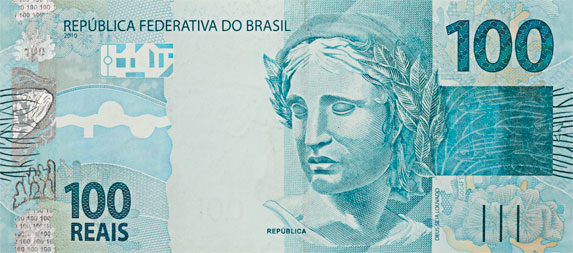
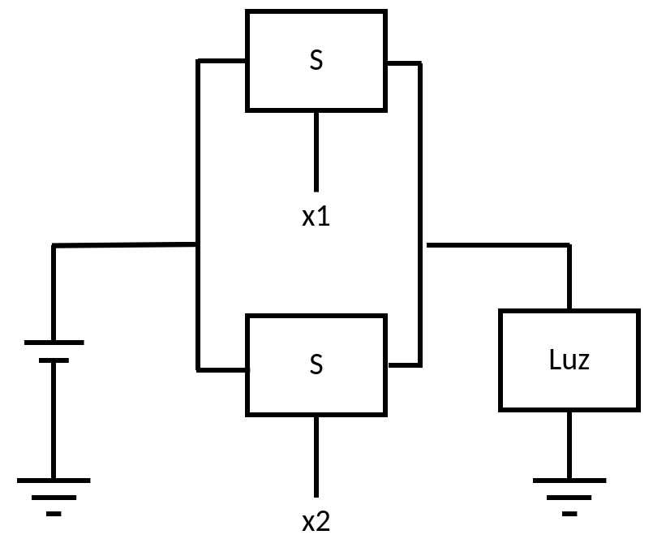
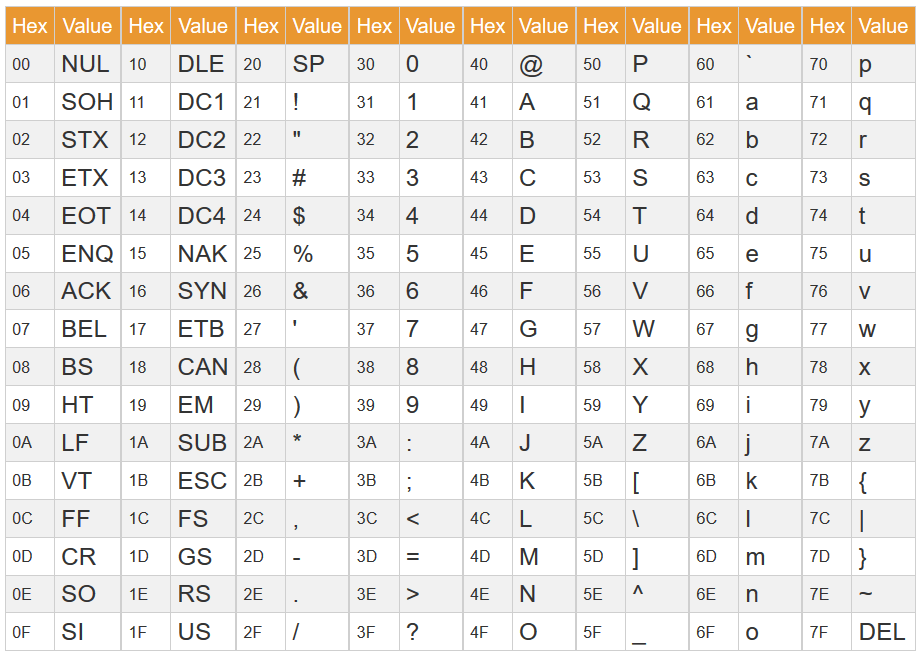

# Sistemas de Numeração

**Rodolfo Azevedo**

MC404 - Organização Básica de Computadores e Linguagem de Montagem

http://www.ic.unicamp.br/~rodolfo/mc404

## Como você contaria R$132,00?

### 
### 
### 

## Resposta, R$132,00 =

### 
###   
###  

## Resumidamente, R$132,00 =

### 1 x 
### 3 x 
### 2 x 

## Escolha um dos números abaixo

|  |  |  |  |
|:---:|:---:|:---:|:---:|
| 0 | 1 | 2 | 3 |
| 4 | 5 | 6 | 7 |
| 8 | 9 | 10 | 11 |
| 12 | 13 | 14 | 15 |

## Anote sua resposta para as próximas 4 perguntas

## Seu número está aqui?

|  |  |  |  |
|:---:|:---:|:---:|:---:|
| 8 | 9 | 10 | 11 |
| 12 | 13 | 14 | 15 |

## Seu número está aqui?

|  |  |  |  |
|:---:|:---:|:---:|:---:|
| 4 | 5 | 6 | 7 |
| 12 | 13 | 14 | 15 |

## Seu número está aqui?

|  |  |  |  |
|:---:|:---:|:---:|:---:|
| 2 | 3 | 6 | 7 |
| 10 | 11 | 14 | 15 |

## Seu número está aqui?

|  |  |  |  |
|:---:|:---:|:---:|:---:|
| 1 | 3 | 5 | 7 |
| 9 | 11 | 13 | 15 |

## Vamos advinhar seu número?

## Confira sua resposta

|  |  |  |  |
|:---:|:---:|:---:|:---:|
| **0** | **1** | **2** | **3** |
| Não Não Não Não | Não Não Não Sim | Não Não Sim Não | Não Não Sim Sim |
| **4** | **5** | **6** | **7** |
| Não Sim Não Não | Não Sim Não Sim | Não Sim Sim Não | Não Sim Sim Sim |
| **8** | **9** | **10** | **11** |
| Sim Não Não Não | Sim Não Não Sim | Sim Não Sim Não | Sim Não Sim Sim |
| **12** | **13** | **14** | **15** |
| Sim Sim Não Não | Sim Sim Não Sim | Sim Sim Sim Não | Sim Sim Sim Sim |

## Em binário

|  |  |  |  |
|:---:|:---:|:---:|:---:|
| **0** | **1** | **2** | **3** |
| 0000 | 0001 | 0010 | 0011 |
| **4** | **5** | **6** | **7** |
| 0100 | 0101 | 0110 | 0111 |
| **8** | **9** | **10** | **11** |
| 1000 | 1001 | 1010 | 1011 |
| **12** | **13** | **14** | **15** |
| 1100 | 1101 | 1110 | 1111 |

## Representação digital em binário (base 2)

* Por que binário?
  * 0V --> valor 0
  * Tensão do circuito (tipicamente entre 1V e 5V) --> valor 1

* Como compor números maiores?
  * Mesmo sistema posicional dos números decimais (base 10)

* Em decimal
  * 8547 = 8 x $10^3$ + 5 x $10^2$ + 4 x $10^1$ + 7 x $10^0$
* Em binário
  * 1001 = 1 x $2^3$ + 0 x $2^2$ + 0 x $2^1$ + 1 x $2^0$

  ## Números em Decimal e Binário

| Dec. | Binário || Dec. | Binário || Dec. | Binário || Dec. | Binário |
|:---:|:---:|---|:---:|:---:|---|:---:|:---:|---|:---:|:---:|
| 0 | 0000 || 4 | 0100 || 8 | 1000 || 12 | 1100 |
| 1 | 0001 || 5 | 0101 || 9 | 1001 || 13 | 1101 |
| 2 | 0010 || 6 | 0110 || 10 | 1010 || 14 | 1110 |
| 3 | 0011 || 7 | 0111 || 11 | 1011 || 15 | 1111 |

## E a volta?

* Técnica de divisões sucessivas
  * 57 / 2 = 28 resto **1**
  * 28 / 2 = 14 resto **0**
  * 14 / 2 = 7 resto **0**
  * 7 / 2 = 3 resto **1**
  * 3 / 2 = 1 resto **1**
  * 1 / 2 = 0 resto **1**
* 57 = 111001
* Ou soma/subtração das potências de 2
  * 57 = 32 + 16 + 8 + 1
  * $57 = 2^5 + 2^4 + 2^3 + 2^0$

## Potências de 2

| Potência | Valor || Potência | Valor |
|:---:|:---:|---|:---:|:---:|
| $2^0$ | 1 || $2^5$ | 32 |
| $2^1$ | 2 || $2^6$ | 64 |
| $2^2$ | 4 || $2^7$ | 128 |
| $2^3$ | 8 || $2^8$ | 256 |
| $2^4$ | 16 || $2^9$ | 512 |

* $2^{10}$ = 1024

## Sua vez

* Converta $45_d$ para binário
* Converta $102_d$ para binário
* Converta $100101_b$ para decimal
* Converta $110000111_b$ para decimal

## Potências de 2

| Valor | Sufixo | Sigla || Valor | Sufixo | Sigla |
|:---:|:---:|:---:|---|:---:|:---:|:---:|
| 1000 | K | Kilo || 1024 | Ki | Kibi |
| $1000^2$ | M | Mega || $1024^2$ | Mi | Mebi |
| $1000^3$ | G | Giga || $1024^3$ | Gi | Gibi |
| $1000^4$ | T | Tera || $1024^4$ | Ti | Tebi |
| $1000^5$ | P | Peta || $1024^5$ | Pi | Pebi |
| $1000^6$ | E | Exa || $1024^6$ | Ei | Exbi |
| $1000^7$ | Z | Zetta || $1024^7$ | Zi | Zebi |

## Operações Lógicas - Porta E / AND

## Operações Lógicas - Porta OU / OR

## Operações Lógicas - Porta NÃO / NOT

## Tabela Verdade

| A | B | A AND B | A OR B | A XOR B | NOT A |
|:---:|:---:|:---:|:---:|:---:|:---:|
| 0 | 0 | 0 | 0 | 0 | 1 |
| 0 | 1 | 0 | 1 | 1 | 1 |
| 1 | 0 | 0 | 1 | 1 | 0 |
| 1 | 1 | 1 | 1 | 0 | 0 |

## Portas Lógicas

## Instruções Lógicas

| Instrução | Formato | Uso |
|---|:---:|---|
| XOR | R | XOR rd, rs1, rs2 |
| XOR immediato | I | XORI rd, rs1, imm |
| OR | R | OR rd, rs1, rs2 |
| OR immediato | I | ORI rd, rs1, imm |
| AND | R | AND rd, rs1, rs2 |
| AND immediato | I | ANDI rd, rs1, imm |

> NOT é uma pseudo-instrução que pode ser implementada com XORI.

## Números negativos

* Números negativos podem ser representados em múltiplas formas
  * Complemento de 1
  * Sinal e Magnitude
  * **Complemento de 2**

* É importante notar que trata-se apenas de uma forma de interpretar os dados
  * O computador não sabe se o número é positivo ou negativo
  * O computador apenas sabe que o número é um número binário

## Complemento de 1 (não pretendemos utilizar)

* Regra de conversão: inverte todos os bits
* Dado um número binário, inverte-se todos os seus bits
  * 0110 → 1001
  * 1001 → 0110

* Cabe a você, programador, fazer essa interpretação de números negativos ou positivos
* Continuando com os exemplos:
  * 0110 → 6
  * 1001 → -6

## Sinal e Magnitude (não pretendemos utilizar)

* O primeiro bit do número é o sinal
  * 0 → positivo
  * 1 → negativo
* Os outros bits representam o valor absoluto do número
  * 0110 → 6
  * 1001 → -1

## Complemento de 2 (vamos utilizar essa representação)

* ***Definição:*** É a representação binária que permite que a expressão $x + (-x)$ seja igual a zero.

  0110 + 1010 = 0000 → (6 + -6 = 0)

* **Regra de conversão 1:** Inverte todos os bits (complemento de 1) e soma 1

* **Regra de conversão 2:** Repete os bits da direita para a esquerda até encontrar o primeiro 1 (repete esse um) e inverte todos os bits a partir dele.

> *Se o número tiver o bit mais significativo igual a 1, então ele é negativo. Caso contrário, ele é positivo.*

## Representações de números negativos

* Cada representação tem sua vantagem e desvantagem, em especial
  * Complemento de 1
    * Possui duas representações para o número 0
  * Sinal e Magnitude
    * Possui duas representações para o número 0
  * Complemento de 2
    * Uma representação para o número 0

## Você sabe o significado das palavras abaixo?

| Palavra | O que significa? |
|---|---|
|Borracha||
|Brinco||
|Chulo||
|Enojado||
|Frente||
|Largo||
|Pastel||

## Falso Cognatos em Espanhol

| Palavra em espanhol | O que de fato significa |
|---|---|
|Borracha|Bêbada|
|Brinco|Pulo|
|Chulo|Legal|
|Enojado|Zangado|
|Frente|Testa|
|Largo|Longo|
|Pastel|Bolo|

## O significado dos bits está na interpretação que o código ou usuário faz deles

* O computador não sabe se o número é positivo ou negativo
* O número não está em complemento de 2, ele é apenas um número binário
* Se você interpretar como complemento de 2, você pode ter um resultado diferente

## Sua vez

* Converta os números abaixo para binário em representação de complemento de 2 utilizando 6 bits

| Decimal | Binário em complemento de 2 utilizando 6 bits |
|:---:|---|
| -1 ||
| -6 ||
| -9 ||
| 8 ||
| -15 ||

## Sua vez

* Converta os números abaixo para binário em representação de complemento de 2 utilizando 6 bits

| Decimal | Binário em complemento de 2 utilizando 6 bits |
|:---:|:---:|
| -1 | 111111 |
| -6 | 111110 |
| -9 | 110111 |
| 8  | 001000 |
| -15 | 100001 |

## Representação Hexadecimal (base 16)

* É uma representação compacta para números pois consegue agrupar 4 bits em um único dígito, sendo mais compacta que binário e decimal
* Cada dígito pode ser representado por um número de 0 a 9 ou uma letra de A a F
* A letra A representa o número 10, B representa 11, C representa 12, D representa 13, E representa 14 e F representa 15
* Exemplo:
  * 0110 1001 → 69h → 6 × 16 + 9 = 105
  * 1000 0111 → 87h → 8 × 16 + 7 = 135
  * 0111 1001 → 79h → 7 × 16 + 9 = 121
> Note que 1000 0111 também pode ser -121

## Sua vez

* Converta os números abaixo para hexadecimal

| Binário | Hexadecimal |
|:---:|:---:|
| 0100 1101 ||
| 1010 0101 ||
| 0110 1000 ||

* Você pode representar um número em hexadecimal utilizando letras maiúsculas ou minúsculas
* Você também pode utilizar o prefixo 0x para indicar que o número é hexadecimal no lugar da letra h como sufixo

## Representação de caracteres

## Códigos ASCII são apenas números!

* O caracter 0 tem código 30h (48d) e o caracter 9 tem código 39h (57d)
  * Se você somar o número 9 ao código 48d, você terá o código 57d, que é o código do caracter 9
* O mesmo vale para letras, a letra A tem código 41h (65d) e a letra E tem código 45h (69d)
  * Se você somar o número 4 (E é a quarta letra do alfabeto) ao código 65d, você terá o código 69d, que é o código da letra E.
* A letra A tem código 41h (65d) e a letra a (minúscula) tem código 61h (97d)
  * Se você somar o número 32 a qualquer letra maiúscula, você terá a letra minúscula correspondente
  * Se você subtrair o número 32 a qualquer letra minúscula, você terá a letra maiúscula correspondente

## Representação de caracteres

* A tabela ASCII não é suficiente para representar todos os caracteres de uma língua
* O que fazer quando precisamos representar caracteres que não estão na tabela ASCII?
* Por um bom tempo, a tabela foi dividida em duas partes
  * Primeiros 128 caracteres → Sempre os mesmos para todos os sistemas
  * Demais caracteres → Dependem da localização do sistema
* Exemplo: ISO-8859-1, Windows-1252, etc.

## Unicode

* Unicode é um padrão que define um único conjunto de caracteres para todos os sistemas
* Cada caractere é representado por um número (code point)
* Existem múltiplas codificações para esse número
  * UTF-8
  * UTF-16
  * UTF-32
* Para codificar um conjunto grande de caracteres, são necessários mais bytes
* Caracteres são definidos como U+XXXX, onde XXXX é o número hexadecimal do caractere
* *Existem símbolos Unicode que parecem com outros e foram utilizados, recentemente, como forma de burlar sistemas de segurança*

## Representação de strings

* Strings são sequências de caracteres armazenadas em memória
* Cada caracter está numa posição de memória consecutiva
* Existem duas formas típicas de armazenar strings
  * String terminada em zero (\0) → Formato utilizado em C
  * String cujo primeiro byte indica a quantidade de caracteres à frente

## Endianess (Ordem dos bytes na memória)

* Cada posição de memória tem um endereço individual
* Os registradores do RISC-V são de 32 bits (4 bytes)
* O que acontece se eu armazenar o número 0x12345678 na posição 1000 de memória?

* Como você começa a ler o texto a seguir?

## Endianess (Ordem dos bytes na memória)

* Cada posição de memória tem um endereço individual
* Os registradores do RISC-V são de 32 bits (4 bytes)
* O que acontece se eu armazenar o número 0x12345678 na posição 1000 de memória?

|Posição de Memória|1000|1001|1002|1003|
|---|---|---|---|---|
|Opção 1|0x12|0x34|0x56|0x78|
|Opção 2|0x78|0x56|0x34|0x12|

## Endianess (Ordem dos bytes na memória)

* Cada posição de memória tem um endereço individual
* Os registradores do RISC-V são de 32 bits (4 bytes)
* O que acontece se eu armazenar o número 0x12345678 na posição 1000 de memória?

|Posição de Memória|1000|1001|1002|1003|
|---|---|---|---|---|
|Big Endian|0x12|0x34|0x56|0x78|
|Litle Endian|0x78|0x56|0x34|0x12|

> RISC-V, x86, ARM, NVidia são little endian

## Qual o impacto do Endianess?

* Você não precisa se preocupar com endian se:
  * Seu programa escreve um inteiro na memória e lê um inteiro novamente
  * Você não compartilha dados com nenhum outro computador
* Você precisa se preocupar com endian se:
  * Você está lendo um arquivo binário 
  * Você envia/recebe dados de outro computador que não sabe o formato destino
  * Você está manipulando dados de tamanho diferente da palavra (4 bytes). Ex.: strings, char, short, etc.
  * Você está interagindo com um periférico e não sabe o formato de dados dele

