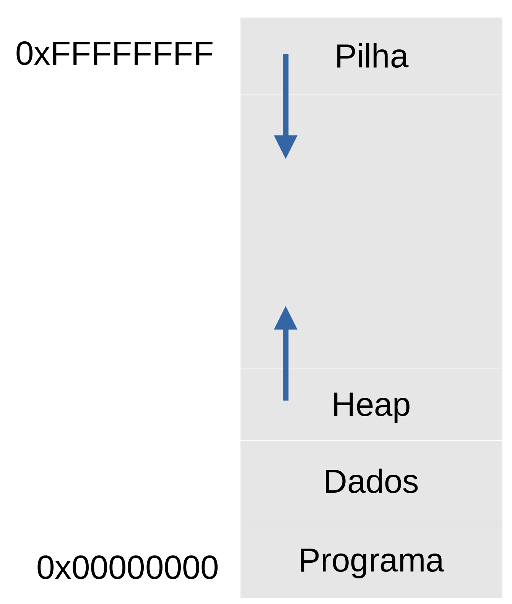
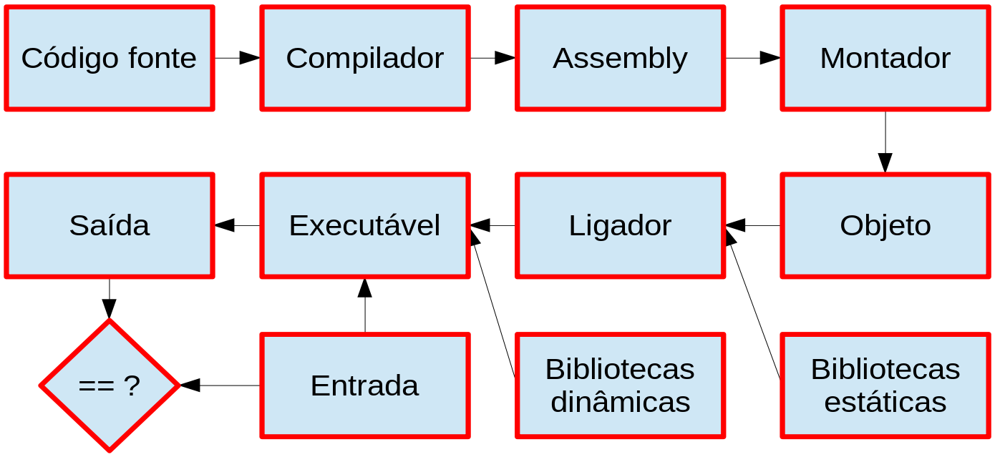
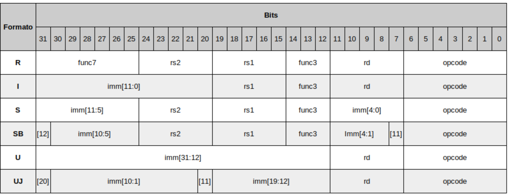

# Organização Básica de Computadores

Rodolfo Azevedo

MC404 - Organização Básica de Computadores e Linguagem de Montagem

http://www.ic.unicamp.br/~rodolfo/mc404

# Tamanho de variáveis

| Linguagem C | Tipo em RISC-V (32 bits) | Tamanho em bytes |
|---|---|---|
| bool | byte | 1 |
| char | byte | 1 |
| short | halfword | 2 |
| int | word | 4 |
| long | word | 4 |
| void | unsigned word | 4 |

> *char*, *short*, *int* e *long* também podem ser unsigned mantendo o tamanho

## Classificação de memórias

* As memórias podem ser classificadas em relação ao uso que se faz delas:
  * **Principal**: Fica próxima ao computador e armazena dados e programas para serem executados/utilizados
  * **Secundária**: Armazena dados e programas que precisam ser carregados para a memória principal para serem executados/utilizados.
* Elas também podem ser classificadas em relação à capacidade de reter dados:
  * **Voláteis**: Perdem os dados quando a energia é desligada
  * **Não voláteis**: Mantém os dados mesmo quando a energia é desligada

## Tipos de Memória

* **RAM**: Memória de acesso aleatório volátil. Utilizada como memória principal dos dispositivos computacionais. Tipicamente têm dois tipos:
  * **SRAM**: Memória estática, mais rápida mas mais cara. Geralmente utilizada em pequena quantidade (em registradores, caches)
  * **DRAM**: Memória dinâmica, mais lenta e mais barata. Geralmente utilizada em grande quantidade (memória principal), como DDR4 e DDR5
* **ROM**: Memória de acesso aleatório não volátil. Utilizada como memória secundária dos dispositivos computacionais. O caso mais comum é o da memória flash, a mesma do seu pendrive, mas que também serve para armazenar dados no seu celular e notebook (SSD).
* **Disco**: Para maiores quantidades de armazenamento, existem os discos rígidos (HDD).

## Revisando a organização da memória

* Seu programa é carregado do disco (ou SSD) para a memória principal (RAM)
* Todo programa só pode ser executado na memória principal
* A memória principal é endereçada em bytes mas, no caso do RISC-V, é acessada por palavras (4 bytes)

## Fluxo de desenvolvimento de código

## Ferramentas de desenvolvimento de código

* **Compilador**: Traduz o código fonte para assembly
* **Assembler** (ou montador): Traduz o assembly para código objeto
* **Linker** (ou ligador): Liga os arquivos de código objeto em um único executável
* **Debugger** (ou depurador): Ferramenta para depurar o código

É necessário padronizar os formatos de arquivos para que os programas possam se comunicar. Por exemplo, o formato de arquivos executáveis é o **ELF** (Executable and Linkable Format) para Linux. Para Windows, é o **PE** (Portable Executable).

## E quanto aos periféricos?

* Do ponto de vista do processador, periféricos são apenas outros itens acessados numa região específica de memória
* O processador não sabe se o dado está na memória principal ou em um periférico
  * O processador sabe apenas enviar um endereço e um comando de leitura
  * Se o endereço corresponder à memória, a memória será ativada e retornará o dado
  * Se o endereço corresponder a um periférico, o periférico será ativado e retornará o dado
* Quem tem essa informação é o programador
* O periférico pode ficar atrás da proteção do sistema operacional assim como o sistema de memória

## RISC vs CISC

* O conjunto de instruções de um processador pode ser complexo ou simples
  * CISC: Complex Instruction Set Computer
  * RISC: Reduced Instruction Set Computer
* Esse conceito foi mudando um pouco com o tempo, hoje temos ISAs RISC com muitas instruções e com um bom grau de complexidade
* Arquiteturas RISC são baseadas em modelos load/store onde todo o acesso à memória só se dá através de instruções explicitas
* É comum arquiteturas RISC possuírem mais registradores
* É comum arquiteturas CISC possuírem instruções com mais sub-ações
* É comum arquiteturas CISC serem implementadas total ou parcialmente com microinstruções

## Multicore vs Multithread

* **Multicore**: Processadores com múltiplos núcleos
  O modelo de fabricação inclui mais de uma unidade de processamento (núcleo) independente dentro do processador. Assim temos processadores de 4 núcleos, 8 núcleos, etc. Cada um funciona como um processador independente, mas compartilham a mesma memória principal.
* **Multithread**: Processadores capazes de executar múltiplas threads
  Um programa precisa de, no mínimo, uma thread. Essa é a menor unidade de execução possível. Um núcleo de processador pode ser capaz de executar multithread, o que significa que ele é capaz de executar múltiplas threads simultaneamente.

> Nenhum programa de MC102 que você fez era multithread! :astonished:

## Codificação das instruções

* Cada instrução precisa ser codificada em uma sequência de bits para que o processador consiga identifica-la
* Para fins dessa disciplina e a versão do processador RISC-V que estamos utilizando, todas as instruções são codificadas em 32 bits
* Deve ser possível, em 32 bits, codificar a instrução, os registradores e o imediato sempre que necessário
* Algumas decisões de projeto são necessárias para conseguir cumprir esse requisito

## Formato de instruções

## Agora que você já sabe os formatos de instruções

* Entendeu que há um limite no número total de registradores (32)?
* Entendeu que há um limite no número máximo de registradores que uma instrução pode utilizar?
* Entendeu que há um limite no tamanho do imediato para as instruções?
