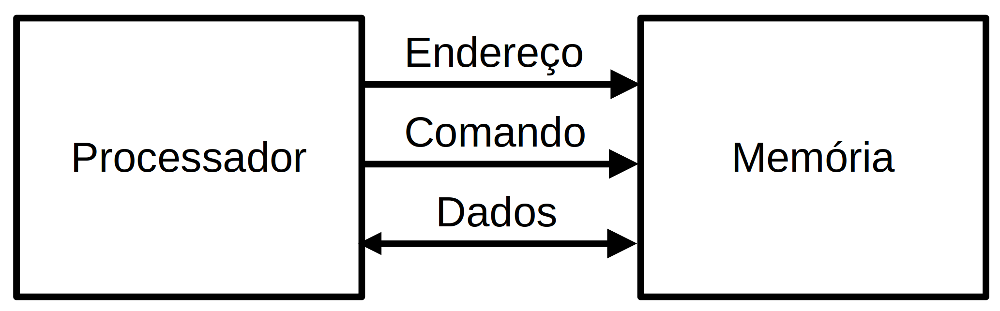

# Organização Básica de Computadores

Rodolfo Azevedo

MC404 - Organização Básica de Computadores e Linguagem de Montagem

http://www.ic.unicamp.br/~rodolfo/mc404

## Como funciona um computador?

## Quais os principais componentes de um computador?

* Processador
* Memória
* Periféricos

## O que um processador faz?

* Executa instruções
  * Codificadas em linguagem de máquina (binário)
  * Seguem um conjunto de instruções (ISA)
* Busca e escreve dados na memória
* Sabe onde está a próxima instrução a ser executada
* Lê e escreve dados nos periféricos
* Utiliza registradores como armazenamento temporário
* Considera o comportamento de uma instrução por vez
  * Pode ser capaz de executar múltiplas instruções, mas o comportamento final deve ser equivalente ao sequencial

## Ciclo de instrução

  * O processador tem um registrador especial, chamado PC, que indica onde está a próxima instrução na memória

### Para executar uma instrução, o processador:
  1. Solicita a leitura da memória enviando o endereço da instrução (PC)
  1. A memória envia o dado (instrução) para o processador
  1. O processador decodifica o dado como instrução
  1. O processador executa a instrução 

## O processador se comunica com a memória

* O processador não *sabe* exatamente o que tem do lado de fora dele, mas *sabe* claramente se comunicar com os componentes externos

  

* Basta enviar o endereço a ser acessado e utilizar um dos dois comandos disponíveis: **Leitura** ou **Escrita**.
* O dado será enviado caso o comando seja de escrita e será recebido caso o comando seja de leitura

## Mas a memória é muito lenta!

* O processador costuma ter **caches**, que nada mais são que memórias menores, mais rápidas, que ficam mais perto dele


* Caches são memórias **pequenas** que conseguem ser colocadas mais próximas do processador e que são mais rápidas que a memória principal
* Por que não fazer a memória principal do mesmo material que as caches?
  * Porque ela ficaria muito cara e de velocidade similar à memória principal atual

## O processador também tem registradores

* Registradores são pequenas células de memória que ficam dentro do processador
* O RISC-V prevê 32 registradores de 32 bits, onde um deles tem valor zero
* As instruções operam diretamente nos registradores, sem precisar acessar a memória
* Existem instruções específicas para ler e escrever dados da memória
  * **Load** faz a leitura de um valor na memória e coloca no registrador
  * **Store** faz a escrita na memória do valor de um registrador
* Existem múltiplas variações de load e store, que diferem no tamanho do dado e no endereçamento

## Como localizar um dado na memória?

* Todos os bytes de memória possuem um endereço
* A memória não usa o *espaço de endereçamento* disponível
* O processador precisa ler mais que um byte por vez
* No RISC-V, todas as leituras são feitas em múltiplos de palavras (4 bytes)


## Como ler um dado de 4 bytes?

* As instruções ocupam 4 bytes, então o PC sempre lê múltiplos de 4 bytes quando se trata de instruções
  * A primeira instrução está na posição 0, a segunda na posição 4, e assim sucessivamente
  * Isso significa que a primeira instrução, por ter 4 bytes, utiliza o byte 0, byte 1, byte 2 e byte 3


# Instruções de Memória

| Instrução | Formato | Uso |
|---|---|---|
| Load word | I | LW rd, rs1, imm |
| Store word | S | SW rs2, rs1, imm |

* Existem variações para Byte (LB e SB) e Halfword (LH e SH)
* Também existem variações para Unsigned (LBU e LHU)

# Exemplo

Somar os dois primeiros elementos do vetor v e guardar na terceira posição do vetor

```c
main() {
  int v[10];
  ...
  v[2] = v[0] + v[1];
}
```

# Exemplo - resolvido

Somar os dois primeiros elementos do vetor v e guardar na terceira posição do vetor

```c
main() {
  int v[10];
  ...
  v[2] = v[0] + v[1];
}
```
  em assembly do RISC-V:

```mipsasm
lw t1, t0, 0   # onde t0 deve ter o endereço de v[0]
lw t2, t0, 4   # lê v[1] -> o próximo endereço após v[0]
add t3, t1, t2
sw t3, t0, 8   # escreve em v[2]
```

# Tamanho de variáveis

| Linguagem C | Tipo em RISC-V (32 bits) | Tamanho em bytes |
|---|---|---|
| bool | byte | 1 |
| char | byte | 1 |
| short | halfword | 2 |
| int | word | 4 |
| long | word | 4 |
| void | unsigned word | 4 |

* *char*, *short*, *int* e *long* também podem ser unsigned


## Fluxo de desenvolvimento de código


## RISC vs CISC

* O conjunto de instruções de um processador pode ser complexo ou simples
  * CISC: Complex Instruction Set Computer
  * RISC: Reduced Instruction Set Computer
* Esse conceito foi mudando um pouco com o tempo, hoje temos ISAs RISC com muitas instruções e com um bom grau de complexidade
* Arquiteturas RISC são baseadas em modelos load/store onde todo o acesso à memória só se dá através de instruções explicitas
* É comum arquiteturas RISC possuírem mais registradores
* É comum arquiteturas CISC possuírem instruções com mais sub-ações
* É comum arquiteturas CISC serem implementadas total ou parcialmente com microinstruções

## Multicore vs Multithread

* **Multicore**: Processadores com múltiplos núcleos
  O modelo de fabricação inclui mais de uma unidade de processamento (núcleo) independente dentro do processador. Assim temos processadores de 4 núcleos, 8 núcleos, etc. Cada um funciona como um processador independente, mas compartilham a mesma memória principal.
* **Multithread**: Processadores capazes de executar múltiplas threads
  Um programa precisa de, no mínimo, uma thread. Essa é a menor unidade de execução possível. Um núcleo de processador pode ser capaz de executar multithread, o que significa que ele é capaz de executar múltiplas threads simultaneamente.

> Nenhum programa de MC102 que você fez era multithread! :astonished:

## Roteiro

* Organização básica de computadores
* Ciclo de instrução
* Registradores
* Memória
* Periféricos
* Endereçamento
* Ciclo de desenvolvimento de código
